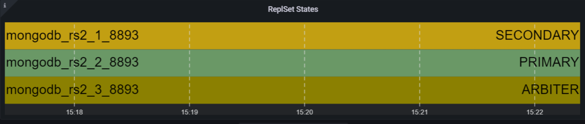

# Percona Monitoring and Management 2.41.1

| **Release date** | Jan 24, 2024                                                                                   |
| ----------------- | ----------------------------------------------------------------------------------------------- |
| **Installation** | [Installing Percona Monitoring and Management](https://www.percona.com/software/pmm/quickstart) |

Percona Monitoring and Management (PMM) is an open source database monitoring, management, and observability solution for MySQL, PostgreSQL, and MongoDB.

It enables you to observe the health of your database systems, explore new patterns in their behavior, troubleshoot them and execute database management operations—regardless of whether your databases are located on-premises or in the cloud.

## Release Highlights

### Improved support for Arbiter nodes

We've made it easier to add MongoDB Arbiter nodes to PMM, as this no longer requires workarounds for cases where authorization is enabled on the MongoDB replica set. Additionally, Arbiter nodes are now displayed correctly on the dashboards:

### New metric for sharded MongoDB insights

We've added a new metric to our MongoDB exporters: `mongodb_shards_collection_chunks_count`. This metric is available for sharded Mongo instances, offering insights into the distribution of collection chunks across different shards.

Explore and leverage this new metric to enhance your understanding of your sharded MongoDB setup.

## Improvements
- [PMM-12390](https://jira.percona.com/browse/PMM-12390) - [Backup Management]: The **Service name** field on the Create Backup pages is now case-insensitive, allowing for more comprehensive and accurate results retrieval.

- [PMM-12712](https://jira.percona.com/browse/PMM-12712) - MongoDB sharded cluster metrics now include a new metric to represent database and collection distribution across different shards. This helps gain insights into the overall balance of shards within MongoDB setups.
- [PMM-12510](https://jira.percona.com/browse/PMM-12510) - Improved workflow for adding MongoDB Arbiter nodes to PMM, which also ensures that Arbiter nodes are now displayed correctly on the dashboards.

## Bugs Fixed

- [PMM-12652](https://jira.percona.com/browse/PMM-12652) - Fixed issue where PMM failed to start after an upgrade, due to SELinux restrictions on accessing a PMM file created with root ownership on Podman. This fix applies to upgrades from PMM 2.41.0 to newer versions.
- [PMM-9825](https://jira.percona.com/browse/PMM-9825) - [QAN]: PostgreSQL databases, monitored using the [pg_stat_monitor extension v2.0+](https://docs.percona.com/percona-monitoring-and-management/setting-up/client/postgresql.html#pg_stat_monitor), were previously displayed with User IDs rather than actual User Names in the **Service Name** column on the **Query Analytics (QAN)** page. This issue is now fixed.
- [PMM-12621](https://jira.percona.com/browse/PMM-12621) - [Dashboards]: Added support for the Anonymous mode to show all Service types on the main menu. This ensures users can access the dashboards, even when PMM is configured in Anonymous mode.
- [PMM-12425](https://jira.percona.com/browse/PMM-12425) - [QAN]: The **Absolute time range** time picker on the **Query Analytics (QAN)** page no longer displays an error when using 'now' instead of a specific timestamp for filtering dashboard data.
- [PMM-12473](https://jira.percona.com/browse/PMM-12473) - Fixed monitoring of external services when query string parameters are passed to `--metrics-path`.
