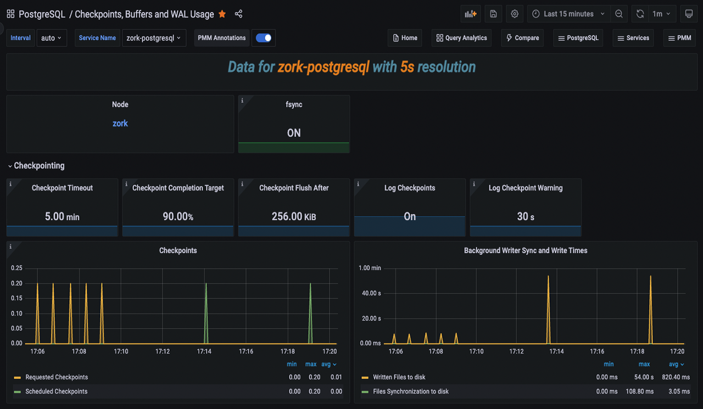
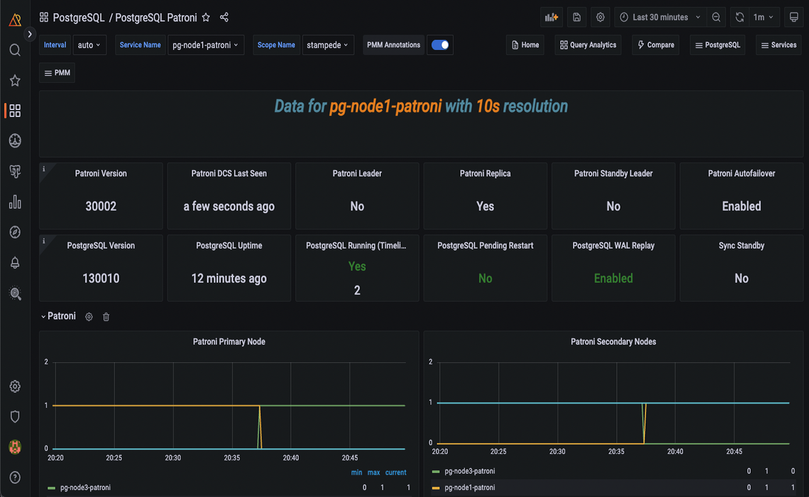
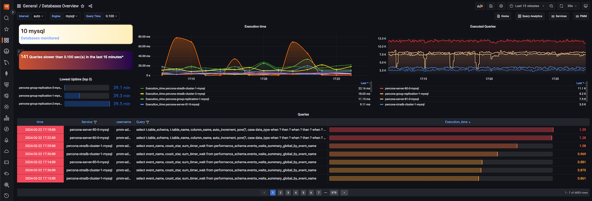
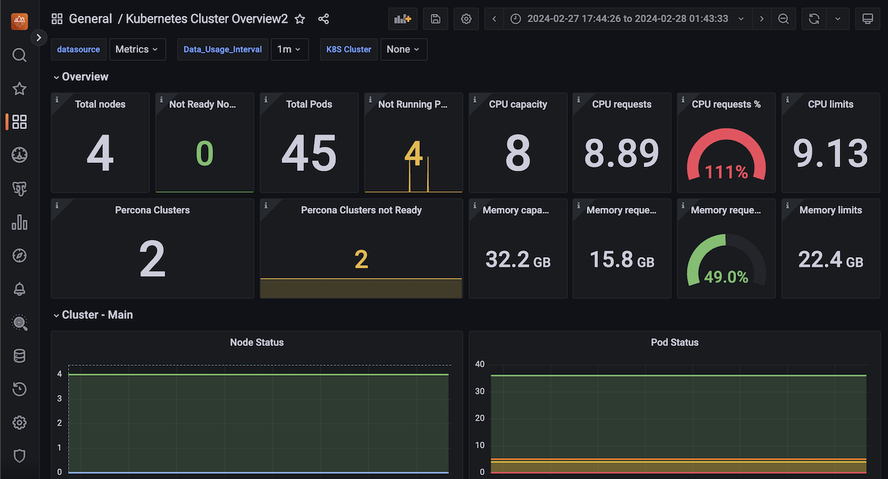

# Percona Monitoring and Management 2.41.2

| **Release date** | March 1st, 2024                                                                                   |
| ----------------- | ----------------------------------------------------------------------------------------------- |
| **Installation** | [Installing Percona Monitoring and Management](https://www.percona.com/software/pmm/quickstart) |

Percona Monitoring and Management (PMM) is an open source database monitoring, management, and observability solution for MySQL, PostgreSQL, and MongoDB.

It enables you to observe the health of your database systems, explore new patterns in their behavior, troubleshoot them and execute database management operations—regardless of whether your databases are located on-premises or in the cloud.

## Release highlights

### Debian 12(Bookworm) pmm-client packages

Starting with PMM 2.41.2, we now offer pmm-client packages for the latest version of Debian. You can install these packages by following the instructions in our [documentation](https://docs.percona.com/percona-monitoring-and-management/setting-up/client/index.html#package-manager).

### New experimental dashboards

!!! warning "warning"
    These **experimental** dashboards are subject to change. It is recommended to use these dashboards for testing purposes only.

#### PostgreSQL Checkpoints, Buffers, and WAL Usage Dashboard

In our continuous effort to enhance our dashboards, we have introduced this new experimental dashboard that provides more data about your PostgreSQL instances.

By leveraging this data, administrators can gain insights into their PostgreSQL servers and fine-tune their performance. Understanding and managing checkpoints, buffers, and WAL usage contribute to a well-performing and reliable PostgreSQL environment.

If you’re looking for in-depth insights into this dashboard, refer to our [blog post](https://www.percona.com/blog/postgresql-checkpoints-buffers-and-wal-usage-with-percona-monitoring-and-management/).

#### PostgreSQL Patroni dashboard

Starting with PMM 2.41.2, we have included a new dashboard designed to monitor [Patroni](https://patroni.readthedocs.io/en/latest/) as an external service. For more information, see our documentation on [external services](https://docs.percona.com/percona-monitoring-and-management/setting-up/client/external.html).

This dashboard facilitates gathering more data for your PostgreSQL cluster inside PMM. Learn more about this dashboard and how to add Patroni monitoring by reading our [blog post](https://www.percona.com/blog/monitoring-a-postgresql-patroni-cluster/).

#### Databases overview dashboard

The latest release introduces a new dashboard that offers a simplified overview of the databases being monitored by PMM. This dashboard aims to provide a centralized and unified place where the crucial parameters for database performance can be easily accessed. 

If you're looking for more information on this dashboard, see the [blog post]().

#### Reworked Kubernetes dashboards

Percona Monitoring and Management (PMM) 2.41.2 now features improved Kubernetes dashboards that are clearer and more user-friendly.

- The redundant information has been removed from some of these dashboards.
- The **Overview** dashboard, which has now been renamed as **Kubernetes Cluster Overview**, has been reorganized and improved for better functionality.
- The **DB Cluster** dashboard has been renamed as **Databases on Kubernetes** and now displays dynamic information. Furthermore, it separates database/proxy details and shows resource limits. 

These changes aim to improve user experience while adhering to PMM standards, particularly for managing multiple clusters.

#### PostgreSQL Instance Summary dashboard

The PostgreSQL Instance Summary dashboard is a newly designed feature that displays the critical PostgreSQL metrics. This dashboard aims to assist DBAs and developers in identifying PostgreSQL issues quickly.

## Improvements

[PMM-10974](https://perconadev.atlassian.net/browse/PMM-10974) Usage of pg\_stat\_monitor by default

[PMM-12884](https://perconadev.atlassian.net/browse/PMM-12884) pmm-dump fails to upload the file to SFTP

[PMM-12887](https://perconadev.atlassian.net/browse/PMM-12887) \[Tech Preview\] Dashboard for monitoring PostgreSQL checkpoints, buffers and WAL usage

[PMM-12960](https://perconadev.atlassian.net/browse/PMM-12960) \[Tech Preview\] Reworking k8s dashboards

## Bug

[PMM-12348](https://perconadev.atlassian.net/browse/PMM-12348) Ordinary clickhouse engine should be updated to Atomic after upgrading PMM to version 2.41.0

[PMM-12785](https://perconadev.atlassian.net/browse/PMM-12785) VictoriaMetrics scrape configuration contains unsupported params

[PMM-12805](https://perconadev.atlassian.net/browse/PMM-12805) Logs get filled with \`CommandNotSupportOnView\` message

[PMM-12806](https://perconadev.atlassian.net/browse/PMM-12806) PMM does not honor the environment variables for VictoriaMetrics

[PMM-12809](https://perconadev.atlassian.net/browse/PMM-12809) CVEs in PMM v2.40.1\+

[PMM-12852](https://perconadev.atlassian.net/browse/PMM-12852) Changing settings give internal server error
