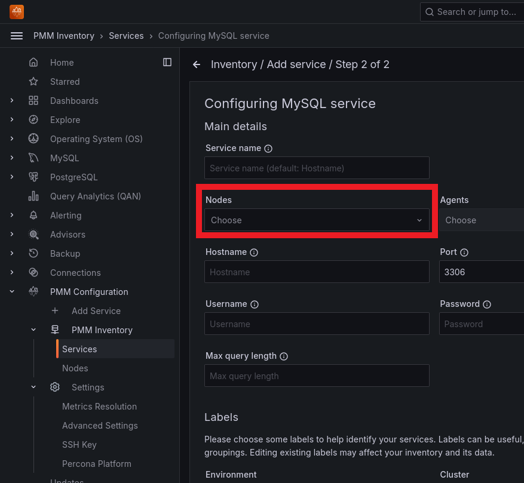

# Percona Monitoring and Management 3.0.0 Beta

| **Release date** | September 16th, 2024                                                                                   |
| ----------------- | ----------------------------------------------------------------------------------------------- |
| **Installation** | [Installing Percona Monitoring and Management](https://www.percona.com/software/pmm/quickstart) |

Percona Monitoring and Management (PMM) is an open source database monitoring, management, and observability solution for MySQL, PostgreSQL, and MongoDB.

It enables you to observe the health of your database systems, explore new patterns in their behavior, troubleshoot them and execute database management operations—regardless of whether your databases are located on-premises or in the cloud.

## Release highlights

### Encryption of sensitive data

To strengthen the security of your monitoring setup, all sensitive information stored in the PMM Server database, including usernames, passwords, AWS keys, Azure credentials, and TLS/SSL certificates, is now encrypted.

By default, an encryption key is automatically generated and stored at `/srv/pmm-encryption.key`. You also have the option to specify a custom path for the encryption key using the new environment variable `PMM_ENCRYPTION_KEY_PATH`.

When upgrading to PMM 3, any existing unencrypted PMM 2 data will be encrypted automatically.

## Distribute monitoring across multiple nodes

You can now run database exporters from any PMM Client node, which means you can distribute the monitoring load across multiple PMM Clients. This is especially useful for monitoring cloud-hosted databases like RDS.

When adding a new service through the PMM UI, you can now select the node that will run the exporter. By default, PMM Server is chosen, but you have the option to select any node with a PMM Client installed. If a node has multiple Clients installed, you can choose which one to use.

Currently, this feature is available only when adding new services. Support for editing existing services will be included in a future update.

For more details, see [Connect services](../install-pmm/install-pmm-client/index.md##connect-services).



### Grafana Angular support discontinuation

Grafana will discontinue support for Angular starting with version 12, expected in 2025. This affects numerous panels and plugins, including but not limited to Graph and Table panels. 

We have already migrated many plugins to newer technologies and are actively working on the remaining components to ensure continued functionality. We recommend that you review all plugins in your dashboards and begin planning transitions to newer panel types where necessary.

For a comprehensive list of affected plugins and guidance on migration, see [Grafana's official documentation](https://grafana.com/docs/grafana/latest/developers/angular_deprecation/angular-plugins/) on Angular deprecation and plugin migration.

We will provide regular updates on our migration progress in future releases to help you prepare for this change and modernize your dashboards.

## New default password for AWS Marketplace instances

PMM Server instances launched via AWS Marketplace now use the EC2 instance ID as the default password for the '*admin*' user.

This change stems from our recent transition to Docker-based deployment, ensuring secure and consistent initial access across all new AWS Marketplace instances.

Only new PMM instances launched via AWS Marketplace are affected by this update. For existing instances, continue to use 'admin' as the default password.

IMPORTANT: Make sure to change the default password immediately after first login.

For more information, see [Install PMM Server on AWS Marketplace](../install-pmm/install-pmm-server/aws/aws.md)


### Breaking API changes

#### Removed database ID prefixes

We have removed prefixes from database record identifiers (IDs) in PMM to improve API compatibility with REST and to simplify ID handling.
For example, an ID that was previously `/agent_id/7cae8a44-8210-4f00-a679-764fa8303ee8` is now simply `7cae8a44-8210-4f00-a679-764fa8303ee8`.

This change affects various components, including nodes, agents, services, and backup-related entities. As a result:

- Database identifiers are now represented as plain UUIDs without prefixes: `/node_id/`, `/agent_id/`, `/service_id/`, etc.
- API endpoints using IDs as path parameters now use a new format
- Exporter passwords (previously identical to the prefixed `agent_id` value) have changed
- Metrics labels, that used `agent_id` value, have been updated

##### Impact

Make sure to update any custom scripts, integrations, or alerts that rely on the old exporter ID format to ensure compatibility with this new structure.

#### Simplified boolean feature controls

We have replaced the so-called `dual booleans` with single booleans for feature toggles in our API to improve usability and simplify code implementation. Additionally, we've made primitive values `optional` to enhance type handling.

This change affects various API endpoints that control feature toggles and how we handle primitive types. As a result:

- Feature states are now represented by a single enabled boolean key
- API requests to toggle features now use a new, simplified format
- Responses from the API will consistently use the new format
- The API can now distinguish between unset values and empty/zero values for primitive types
- Slices and maps continue to use their standard representations without wrappers

##### Example of new format

```json
{"enable_feature": true}  // To enable a feature
{"enable_feature": false} // To disable a feature
```

##### Impact

Ensure you update any custom scripts, integrations, or frontend code that interact with feature toggles in the API. 

Review your codebase for any logic that relies on the previous dual boolean system and update accordingly.

#### Consistent field emission in API responses

We have updated our API to consistently emit all fields in responses, including those with default or zero values. This change improves API clarity and affects how API responses are structured. As a result:

- All API responses now include fields with zero or default values
- API documentation accurately reflects actual API responses
- Responses provide a more complete picture of available settings and their current values
- It's now easier to differentiate between unset fields and those with default or empty values

##### Example of new response format

```json
{
  "settings": {
    "updates_enabled": true,
    "telemetry_enabled": true,
    "metrics_resolutions": {
      "hr": "5s",
      "mr": "10s",
      "lr": "60s"
    },
    "data_retention": "2592000s",
    "ssh_key": "",
    "aws_partitions": ["aws"],
    "advisor_enabled": true,
    "platform_email": "",
    "alerting_enabled": true,
    "pmm_public_address": "",
    "advisor_run_intervals": {
      "standard_interval": "86400s",
      "rare_interval": "280800s",
      "frequent_interval": "14400s"
    },
    "backup_management_enabled": true,
    "azurediscover_enabled": false,
    "connected_to_platform": false,
    "default_role_id": 1
  }
}
```

##### Impact

Ensure you review and update any custom scripts, integrations, or code that parse API responses. The new format provides more consistent and complete information, but may require updates to existing parsing logic.

Be aware that API responses will be more verbose, including all defined fields regardless of their values. This change improves clarity but may slightly increase the size of API responses.

#### Removed Inventory API section from documentation

We have streamlined our API documentation by removing most of the low-level Inventory API sections and focusing instead on the Management API for inventory-related tasks. If you are using the Inventory API in your integrations or scripts, make sure to review the updated API documentation for the correct endpoints.


#### Streamlined API endpoints for Services, Nodes, and Agents

We have simplified our API structure by consolidated multiple endpoints into single, versatile endpoints for Services, Nodes, and Agents:


##### Services API update

A new `POST /v1/inventory/services` endpoint replaces individual service-specific endpoints. You can now specify the service type (mysql, mongodb, postgresql, proxysql, haproxy, external) as a top-level property in the request payload. For example:

```json
{
  "mysql": {
    "service_name": "mysql-sales-db-prod-1",
    "node_id": "pmm-server",
    "address": "209.0.25.100",
    "port": 3306
    // ... other properties
  }
}
```

##### Nodes API update

Similarly, `POST /v1/inventory/nodes` now handles all node types (generic, container, remote, remote_rds, remote_azure). The node type is specified in the request payload:

```json
{
  "generic": {
    "node_name": "mysql-sales-db-prod-1",
    "region": "us-east-1",
    "az": "us-east-1a",
    "address": "209.0.25.100"
    // ... other properties
  }
}
```


##### Agents API update

The Agents API follows the same pattern, with a single endpoint for all agent types - `POST /v1/inventory/agents`. The agent type is specified as the top-level property in the request payload:

```json
{
  "mysqld_exporter": {
    "pmm_agent_id": "pmm-server",
    "service_id": "13519ec9-eedc-4d21-868c-582e146e1d0e",
    "username":  "mysql-prod-user",
    "password":  "mysql-prod-pass",
    "listen_port": 33060,
    "custom_labels": {
      "department":  "sales",
      "environment": "sales-prod",
      "replication_set": "db-sales-prod-1-rs1",
      "cluster": "db-sales-prod-1"
    }
  }
}
```

##### Impact

Update your API calls to use the new consolidated endpoints. Review the updated API documentation in the Swagger UI of your PMM instance for the new request formats.
