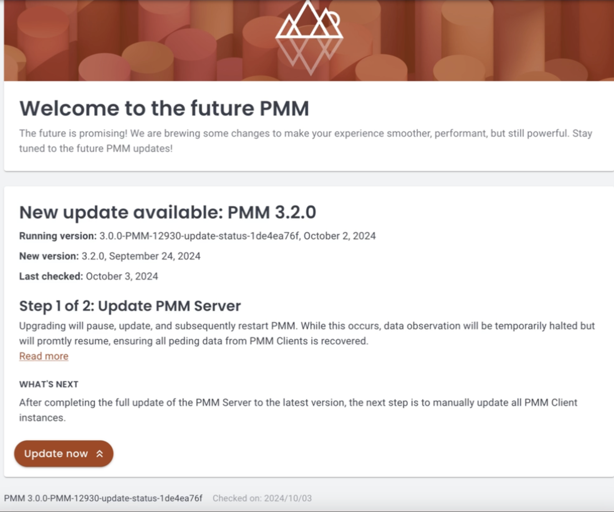
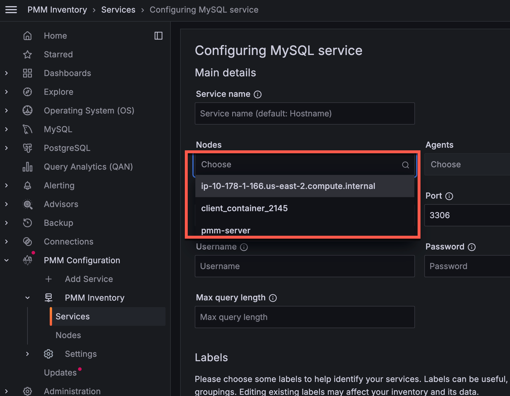

# Percona Monitoring and Management 3.0.0 Beta

| **Release date** | October 21st, 2024                                                                                   |
| ----------------- | ----------------------------------------------------------------------------------------------- |
| **Installation** | [Installing Percona Monitoring and Management](https://www.percona.com/software/pmm/quickstart) |

Percona Monitoring and Management (PMM) is an open source database monitoring, management, and observability solution for MySQL, PostgreSQL, and MongoDB.

It enables you to observe the health of your database systems, explore new patterns in their behavior, troubleshoot them and execute database management operations—regardless of whether your databases are located on-premises or in the cloud.

## Release highlights

### Security enhancements for developing and using PMM

Using the root user in applications poses a significant security threat, especially if outdated software is installed or located nearby.

#### Run PMM without root permissions

PMM Server can now be deployed rootless using various methods, including the latest versions of Podman, Helm, Docker, Virtual Appliance, or Amazon AWS.

This setup prioritizes security by eliminating the need for root privileges to create, run, and manage containers. Running PMM Server as a non-root user means that you never have to give a user root permission on the host. This adds an extra layer of security, essential for protecting against potential security breaches.

For detailed instructions on deploying rootless PMM, check the [Setting up PMM Server](https://docs.percona.com/percona-monitoring-and-management/setting-up/index.html#set-up-pmm-server) topic.

#### Encryption of sensitive data

One of the top ten risks identified by OWASP is the issue of unprotected passwords in systems. Previously, PMM faced this problem. Even though we requested accounts for PMM with the minimal necessary permissions, these monitoring accounts, if compromised, could still expose sensitive data.

To strengthen the security of your monitoring setup, all sensitive information stored in the PMM Server database, including usernames, passwords, AWS keys, Azure credentials, and TLS/SSL certificates, is now encrypted.

By default, an encryption key is automatically generated and stored at `/srv/pmm-encryption.key`. You also have the option to specify a custom path for the encryption key using the new environment variable `PMM_ENCRYPTION_KEY_PATH`.

When upgrading to PMM 3, any existing unencrypted PMM 2 data will be encrypted automatically.

For more information, see [PMM data encryption](../pmm-admin/security/data_encryption.md).

#### Enhanced API authentication with Grafana service accounts

With the release of PMM 3.x, we've made a significant enhancement to the way API authentication is handled. PMM no longer relies on API keys as the primary method for controlling access to the PMM Server components and resources. Instead, PMM now leverages Grafana service accounts, which provide a more secure and manageable authentication mechanism compared to API keys.

The transition to service accounts brings the following advantages:

- Fine-grained access control, ensuring that each account gets access only to the necessary resources.
- Logging of all actions performed, providing better visibility and auditing.

When you install PMM 3.x, any existing API keys will be seamlessly converted to service accounts with corresponding service tokens. For more information about using service accounts in PMM, see [Service account authentication](../api/authentication.md).

### Stability of PMM and its operations

#### Enhanced PMM deployment and maintenance on AMI and OVF environments

Managing AMI/OVF, which were created differently from the primary Docker-based version of PMM, has always posed challenges for users and Percona. This often resulted in extended investigation times and delays in resolving issues. Additionally, the lower adoption rates of these methods contributed to some fixes being released later than expected.
PMM is now deployed in containers within AMI and OVF instances. These containers are managed via Podman and operate in rootless mode, which means they do not require root privileges to run.
This approach significantly increases security and ensures a consistent and unified experience across different deployment types.

#### More stable and quicker upgrades

The current PMM has two methods for upgrades. One method involving "updating packages internally" was particularly useful because it allowed users to upgrade by using the Update button in PMM. However, this method caused issues for users when there were connection problems or when packages were damaged or incorrect. Resolving these broken upgrades was challenging due to the unpredictability of when and in what state the problems occurred.

PMM 3, we're enhancing the stability and speed of the upgrade process by transitioning from RPM updates to exclusive container updates. This streamlined method resolves upgrade glitches, ensures smoother experiences for Docker, Podman, and OVF/AMI setups, and improves our testing workflows.

At the same time, we're maintaining the UI upgrade option by integrating [Watchtower](https://containrrr.dev/watchtower/), an external upgrading tool. When you click the **Upgrade Now** button on the Home Dashboard, Watchtower seamlessly replaces the PMM Server container and links the new one to the existing volume, preserving all data and settings intact.

Watchtower commands are seamlessly integrated into the Easy-Install script, allowing for a one-step setup of PMM alongside Watchtower. Until then, you can manually test the PMM installation by following the instructions for [installing PMM Server with Docker container](../install-pmm/install-pmm-server/index.md).

### Improved user experience

#### New upgrade UI

We developed a new Update section in PMM to clarify the upgrade process and support the new method of upgrading.

We've enhanced PMM's update system with a new **Update** page, accessible via **PMM Configuration > Updates**. This new intuitive interface replaces the previous RPM-based update method, allowing you to easily track versions, configurations, and the health status of your PMM Server and Clients.

This change comes with proactive notifications, alerting you immediately when new versions are released, and providing detailed change summaries so you can make informed decisions before upgrading.

#### Flexible monitoring configurations  

Simplify adding Databases to PMM, no need to do everything from CLI for DB and node monitoring, just install PMM on DB and then use UI for future configuration.

A larger amount of Remote or RDS nodes to be monitored by distributing load from PMM Server.

You can now run database exporters from any PMM Client node, which means you can distribute the monitoring load across multiple PMM Clients. This is especially useful for monitoring cloud-hosted databases like RDS.

When adding a new service through the PMM UI, you can now select the node that will run the exporter. By default, PMM Server is chosen, but you have the option to select any node with a PMM Client installed. If a node has multiple Clients installed, you can choose which one to use.

Currently, this feature is available only when adding new services. Support for editing existing services will be included in a future update.

For more details, see [Connect services](../install-pmm/install-pmm-client/index.md##connect-services).

#### Simplified AWS installation process

While reworking internals for the AWS images, we have simplified the installation process. For version 3, the installation will follow the same steps as the usual Docker or Postman-based installation. After installation, you will encounter the standard PMM login screen (in version 2, there was an additional screen).

The only difference for AWS deployments is that, for security reasons, the default password for PMM cannot be used. Instead, we will use the instance ID as the password for your PMM. Therefore, on the login screen, you need to enter the username as **admin** and the password as your **Instance ID**. You can obtain your instance ID from your AWS console, and you can read more in our documentation.

For more information, see [Install PMM Server on AWS Marketplace](../install-pmm/install-pmm-server/aws/aws.md).

#### ARM support for PMM Client

ARM technology is gaining significant attention across various environments, allowing users to run all popular databases on this platform. To enhance database monitoring in these scenarios, we are introducing ARM support in the PMM Client. This update will enable our users to rely on PMM in any architectural setup.

Another advantage of ARM technology is the cost of infrastructure. It is usually less expensive than other popular technologies. Having ARM builds for PMM enables people to utilize such architectures and save on their infrastructure costs.

Another important role for ARM is it’s usually cheaper to use so beside the better coverage

#### Improved UX with Grafana's latest release

PMM now integrates Grafana 10.4, which delivers the following important enhancements alongside all the advancements introduced since the previous Grafana 9.2.20 integration.

For the full list of changes included in this update, see [Grafana's 10.4 release blog](https://grafana.com/blog/2024/03/06/grafana-10.4-release-all-the-latest-features/).

#### Grafana Angular support discontinuation

Grafana will discontinue support for Angular starting with version 12, expected in 2025. This affects numerous panels and plugins, including but not limited to Graph and Table panels.

We have already migrated many plugins to newer technologies and are actively working on the remaining components to ensure continued functionality. We recommend that you review all plugins in your dashboards and begin planning transitions to newer panel types where necessary.

For the full list of affected plugins and guidance on migration, see [Grafana's official documentation](https://grafana.com/docs/grafana/latest/developers/angular_deprecation/angular-plugins/) on Angular deprecation and plugin migration.

We will provide regular updates on our migration progress in future releases to help you prepare for this change and modernize your dashboards.

### Monitoring improvements

#### Added monitoring support for default PostgreSQL database

PMM now collects metrics from its internal PostgreSQL database, displaying them in all PostgreSQL dashboards and QAN.

While using the default database isn't recommended, this provides better monitoring coverage for users who rely on this setup.

    - We have added monitoring support for the default PostgreSQL database in PMM. Over time, we noticed a significant issue: some users were unable to see the full activity of their database servers. This was due to certain database users relying on default PostgreSQL databases for their applications, and many monitoring tools tend to overlook these databases.
    - To address this, we decided to make default databases fully visible in PMM v3, including all related metrics and data. This enhancement ensures our users have comprehensive visibility over database usage. It also allows them to advise developers and other database consumers against using default databases, as this is not a recommended practice.

#### [Tech Preview] support for PSMDB  and Community MongoDB 8.0

The new version of MongoDB, along with its Percona version [link provided if released], includes numerous improvements and significant performance enhancements [link to release notes for MongoDB 8]. In this version of PMM, we are also adding support for MongoDB 8, allowing MongoDB users to monitor their new version and observe its performance impact.

Added initial support for monitoring Percona Server for MongoDB (PSMDB) 8.0 deployments in PMM. This includes updates to `mongodb_exporter` to accommodate PSMDB 8.0’s revised metrics structure and renamed metrics (e.g., `wiredTiger.concurrentTransactions` is now `queues.execution`).

This enhances monitoring, particularly for sharded cluster deployments, and requires PMM Agent version 2.43.1 or later.

Keep in mind that some dashboard metrics may need further updates to fully support MongoDB 8.0's new format.

#### QAN improvements

### Increased query length limit for MongoDB in QAN

For MongoDB queries, the default maximum query length in Query Analytics (QAN) is now 4096 characters (up from 2048).
This better supports long queries and aggregation pipelines while reducing truncation errors. Other databases retain the 2048-character limit.

### Enhanced MySQL SlowLog query identification

Improved MySQL Slow Log query identification by extending the query ID length from 16 to 32 characters. This reduces the likelihood of ID collisions and ensures more accurate and reliable QAN results.

#### Stable Node metrics collection

The Node Exporter within PMM is responsible for collecting metrics related to the node itself, which is crucial for understanding the relationship between the database and the underlying infrastructure. This release of PMM is based on version 1.8.2 of the exporter, which offers improved security, new metrics (not yet utilized by PMM, but available for users to experiment with on their custom dashboards), and bug fixes. We have dedicated over two years to enhancements in this version compared to the previous one.

### Breaking changes and deprecations

#### Oracle Enterprise Linux 9 images only

With Enterprise Linux 7 (EL7) approaching its end-of-life date, we've made sure that PMM 3 exclusively uses Oracle Enterprise Linux 9 (EL9) as the base system for all PMM images.

We began this transition from CentOS 7 to EL9 with the latest PMM 2 releases, and now with PMM 3, we are no longer building Docker containers, AMIs, or OVFs based on EL7.

By moving to EL9, we ensure that PMM is built on most recent library versions and stays compatible with new technologies. Moreover, EL9 grants access to faster upstream responses to issues, particularly those concerning security, so that your PMM setup remains up-to-date and secure.

Due to this change, PMM 3 cannot be started on host servers running EL7.

#### Finalized DBaaS migration to Percona Everest

In previous PMM releases, the Database as a Service (DBaaS) functionality has been gradually transferred to Percona Everest, an open source cloud-native database platform that solves the challenge of public cloud DBaaS vendor lock-in.

With Percona Everest, you gain the ability to provision and oversee highly performant database clusters on the infrastructure you manage, whether it's your preferred cloud environment or on-premises. This empowerment extends to regaining control over critical aspects such as data access, database configuration, and the costs associated with cloud-based database operations.

While PMM 2.x versions continue to support existing DBaaS functionality, PMM 3 marks the complete migration, removing all references to DBaaS.

If you are an existing PMM user who relies on DBaaS functionality, we encourage you to explore [Percona Everest](https://www.percona.com/resources/percona-everest) and leverage its advanced features for database deployment. Percona Everest also integrates with PMM to provide monitoring capabilities for your database infrastructure.

To learn more about integrating Percona Everest with PMM and adding monitoring endpoints, see [Add monitoring endpoints in the Everest documentation](https://docs.percona.com/everest/use/monitor_endpoints.html).

#### Breaking API changes

This release introduces major breaking API changes:

- Database record identifiers no longer use prefixes (e.g., `/agent_id/`) and are now represented as plain UUIDs.
- Feature toggles have been simplified from dual booleans to a single boolean control with an `enable_feature` property.  
- API responses now consistently emit all fields including those with default or zero values.
- Service, node, and agent management has been streamlined through consolidated endpoints where the resource type is specified as a top-level property in the request payload.
- Low-level Inventory API sections have been removed from documentation in favor of the Management API for inventory-related tasks.

For detailed information about all these API changes and new endpoints, see the [PMM API documentation](https://percona-pmm.readme.io/v3/reference/release-notes-300beta). 

#### New upgrade environment variables

When migrating from PMM v2 to PMM v3, you’ll need to update your environment variables to match the new naming convention. This is because PMM v3 introduces several important changes to improve consistency and clarity:

- environment variables now use PMM_ prefix
- some boolean flags reversed (e.g., `DISABLE_` > `ENABLE_`)
- removed deprecated variables

To check the Migration reference table, see [Environment variables in PMM](../install-pmm/install-pmm-server/baremetal/docker/env_var.md##variables-for-migrating-from-pmm-v2-to-pmm-v3).

#### Grafana Angular support discontinuation

### Improved navigation

With the 10.4 update, PMM now includes a revamped header with search, breadcrumbs, and a reorganized menu that groups related tools together, making it easier to navigate PMM's features and find what you need:

## Improvements

### Nomad integration for PMM Client

PMM Client packages (DEB, RPM, and tarball) now include the Nomad binary, laying the foundation for expanded functionality in future PMM releases.

While the Nomad binary is now included and properly configured within the PMM Client ecosystem, Nomad agent configuration and execution capabilities will be implemented in future releases, which will unlock more capabilities for PMM.

### Service account name length management

To prevent node registration failures, PMM now automatically shortens service account names longer than 200 characters.

PFor this, PMM creates a truncated name in the format `{prefix}_{hash}`, where:

- **prefix**: a portion of the original name, providing context
- **hash**: a unique identifier to avoid naming conflicts

For example, a long node name such as: 

- `Copyvery_long_mysql_database_server_in_production_environment_with_specific_location_details_and_multiple_configuration_settings_for_east_coast_datacenter_primary_backup_replica_instance_2024`

would now be shortened to: 

- `Copyvery_long_mysql_database_server_in_prod_4a7b3f9d`.

For more information see the [Authentication topic](../api/authentication.md).

### Automated update support for AMI/OVF deployments

The new **Updates** page also enables AMI and OVF deployments to update PMM Server directly from the UI, following the integration of the Watchtower container.

### Docker version management

Added ability to upgrade PMM Server between different version tags, enabling more flexible version management for Docker-based deployments.

### Disabled PostgreSQL telemetry

PMM no longer collects PostgreSQL Pillars telemetry.

This improves compatibility with the upcoming No-root feature and streamlines configuration by relying on PMM’s own telemetry capabilities.

### Internal improvements: System infrastructure and telemetry

We've enhanced PMM’s internal architecture with key updates to system maintenance and telemetry. The telemetry system now connects to Percona’s unified endpoint, aligning PMM with other Percona products for more streamlined and consistent data collection.

We've also optimized deployment scripts to improve system maintenance efficiency and reliability.

## Components upgrade

We've upgraded following PMM components to their latest stable versions to enhance functionality, security, and performance:

- **Grafana 11.1.8**: Includes significant improvements over the previous version 9.2.20 integration in PMM2. For the full list of  Grafana changes included with this update, see [Grafana’s 11.1.8 changelog](https://community.grafana.com/t/changelog-updates-in-grafana-11-1-8/134843) and [Grafana release highlights](https://grafana.com/docs/grafana/latest/whatsnew/).

- **ClickHouse Datasource plugin**: Updated to address security vulnerabilities and maintain system integrity. This update ensures continued reliable operation of ClickHouse-related dashboards.

- **Node Exporter 1.8.2**: Latest stable release improves system metrics collection with upstream enhancements and fixes.
  
- **ClickHouse-go driver**: Upgraded QAN to use version 2 of the driver, improving database connectivity and performance.

## Fixed issues

- [PMM-13452](https://perconadev.atlassian.net/browse/PMM-13452): - Fixed an issue where QAN was not displaying data in the **Details** tab when selecting a query.

- [PMM-13417](https://perconadev.atlassian.net/browse/PMM-13417) - Fixed **Service Summary** panel returning 404 error on the **PostgreSQL Instance Summary** dashboard.
  
- [PMM-13280](https://perconadev.atlassian.net/browse/PMM-13280) - Fixed SSH connectivity issue that prevented users from connecting to OVF instances using SSH keys.

- [PMM-13265](https://perconadev.atlassian.net/browse/PMM-13265) - Fixed error preventing creation of alert rules from the **pmm_postgresql_too_many_connections** template.

- [PMM-13280](https://perconadev.atlassian.net/browse/PMM-13280) - Fixed *"Permission Denied"* errors when trying to SSH into OVF instances using configured SSH keys.

- [PMM-13250](https://perconadev.atlassian.net/browse/PMM-13250) - Fixed "*Method RestoreBackup not implemented*" error that occurred when initiating backup restoration through the API.
  
- [PMM-13122](https://perconadev.atlassian.net/browse/PMM-13122) - Fixed navigation between pages to properly maintain selected service names and timeframes when switching between different dashboards and metrics views.

- [PMM-12949](https://perconadev.atlassian.net/browse/PMM-12949) - Fixed an issue where the **Set up** page was incorrectly displayed on Docker and OVF installations; it now properly redirects to the **Log in** page instead.

- [PMM-12776](https://perconadev.atlassian.net/browse/PMM-12776) - Fixed RBAC metrics filtering functionality that was affected by Grafana 10 upgrade, restoring proper access control rules for metrics.

- [PMM-12013](https://perconadev.atlassian.net/browse/PMM-12013) - Fixed reliability and memory usage issues with RDS monitoring in large deployments by running separate RDS exporters per AWS access key. This improves metric collection stability and reduces memory consumption when monitoring multiple RDS instances.
