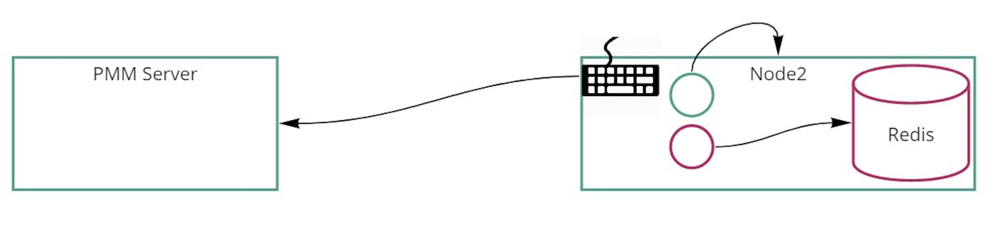
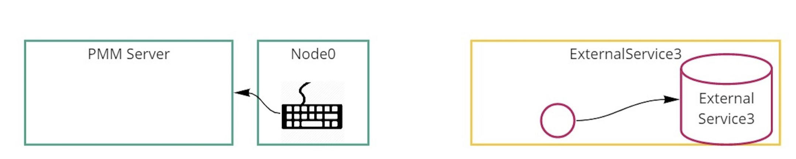
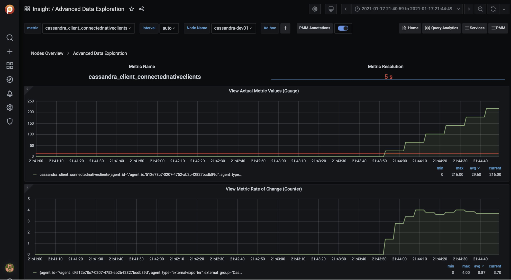

# External Services

## Adding general external services

You can collect metrics from an external (custom) exporter on a node when:

* there is already a PMM Agent instance running and,
* this node has been [configured](/setting-up/client/index.md) using the `pmm-admin config` command.

### Usage

```sh
pmm-admin add external --service-name=<service-name> --listen-port=<listen-port> --metrics-path=<metrics-path> --scheme=<scheme>
```

```sh
pmm-admin add external-serverless --external-name=<external-service-name> --host=<hostname> --listen-port=<listen-port> --metrics-path=<metrics-path> --scheme=<scheme>
```

## Getting data from external exporters

There two ways to get metrics from other exporters.
 - external will collect metrics from the exporter that is run on the same host as pmm-client connection to it by a port.
 See more details in `pmm-admin add external --help`

 - external-serverless - useful to collect metrics from cloud services that expose their metrics. You need a host and port to add it to pmm-server.
 See more details in `pmm-admin add external-serverless --help`

Below you can see two general schemas that show the diffrence between external and external-serverless

Connection schema of exernal exporter:


Connection schema of exernal serverless exporter:



## How I can add something not supported by PMM

PMM can collect any metrics in [Open metrics](https://openmetrics.io) or [Prometheus exposition](https://prometheus.io/docs/instrumenting/exposition_formats/) format.
You need point out on host and port of these metrics using `pmm-admin add external` or `pmm-admin add external-serverless` command.

From this point, PMM will collect and store available metrics.

To browse and visualize collected metrics as the first step, we can look at the Advanced Data Exploration dashboard and select informative services and metrics.



Another way is to create a new Grafana Dashboard to PMM with needed https://grafana.com/docs/grafana/latest/best-practices/best-practices-for-creating-dashboards/

One more way is to search for already create dashboard https://grafana.com/grafana/dashboards for added exporter and import it into PMM.

### Third-party exporters

You can find more exporters on the official Prometheus page: https://prometheus.io/docs/instrumenting/exporters/


### Custom exporter
You can write a custom external exporter or extend your application to expose metric in consumable for Prometheus format.
Please see more details here: https://prometheus.io/docs/instrumenting/writing_exporters/
