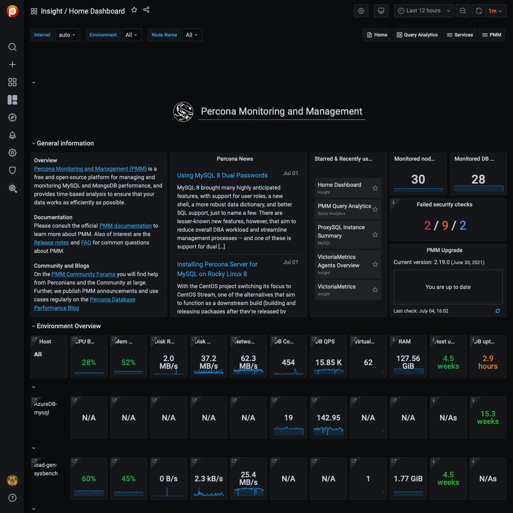

# Virtual Appliance

Run PMM Server as a virtual machine by downloading and importing the [PMM {{release}}][OVA] Open Virtual Appliance (OVA) file into any virtualization software supporting the [OVF standard][OVF].

This section shows this for three popular free desktop hypervisors, [VMware Workstation Player][VMware], [Oracle VM VirtualBox][VirtualBox], and [QEMU]()

Most steps can be done with either a user interface or on the command line, but some steps can only be done in one or the other. Section titles include symbols to show which approach can be used: {{icon.mouse}} for user interface (UI) or {{icon.keyboard}} for command line (CLI).

**Terminology**

- *Host* is the desktop or server machine running the hypervisor.
- *Hypervisor* is software (e.g. VirtualBox, VMware) that runs the guest OS as a virtual machine.
- *Guest* is the CentOS virtual machine that runs PMM Server.

!!! alert alert-info "OVA file details"
	- Download page: <https://www.percona.com/downloads/pmm2/{{release}}/ova>
	- File name: `pmm-server-{{release}}.ova`
	- VM name: `PMM2-Server-{{release_date}}-N` (`N`=build number)
	- VM specifications:
		- CentOS 7.9 (64-bit)
		- CPU: 1
		- Base memory: 4096 MB
		- Disks: LVM, 2 physical volumes
			- Disk 1 (sda): VMDK (SCSI, 40 GB)
			- Disk 2 (sdb): VMDK (SCSI, 400 GB)
	- Username/default password:
		- `root`/`percona`
    	- `admin`/`admin`


```plantuml source="_resources/diagrams/Setting-Up_Server_Virtual-Appliance.puml"
```

## 1. Download {{icon.mouse}} {{icon.keyboard}}

**UI {{icon.mouse}}**

1. Open a web browser.
1. [Visit the PMM Server download page][OVA].
1. Choose a *Version* or use the default (the latest).
1. Click the link for `pmm-server-{{release}}.ova`. Note where your browser saves it.
1. Right click the link for `pmm-server-{{release}}.sha256sum` and save the link to the same place as the `.ova` file.
1. (Optional) [Verify](#verify).

**CLI {{icon.keyboard}}**

	# Download the latest PMM Server OVA and checksum files
	wget https://www.percona.com/downloads/pmm2/{{release}}/ova/pmm-server-{{release}}.ova
	wget https://www.percona.com/downloads/pmm2/{{release}}/ova/pmm-server-{{release}}.sha256sum

## 2. Verify {{icon.keyboard}}

**CLI {{icon.keyboard}}**

	shasum -ca 256 pmm-server-{{release}}.sha256sum


## 3. VMware Workstation Player

### 3.1 Import

**UI {{icon.mouse}}**

1. Select *File --> Import*.
1. Click *Choose file...*.
1. Navigate to the downloaded `.ova` file and select it.
1. Click *Open*.
1. Click *Continue*.
1. In the *Save as* dialog:
	- (Optional) Change the directory or file name.
	- Click *Save*.

1. Either:
	- (Optional) Click *Finish*. This starts the virtual machine.
	- (Recommended) Click *Customize Settings*. This opens the VM's settings page without starting the machine.

**CLI {{icon.keyboard}}**

1. Install [`ovftool`][OVFTool]. (You need to register.)

1. Import and convert the OVA file. (`ovftool` can't change CPU or memory settings during import but it can set the default interface.)

	Choose one of:

	- Download and import the OVA file.
		```
		ovftool --name="PMM Server" --net:NAT=Wi-Fi\
		https://www.percona.com/downloads/pmm2/{{release}}/ova/pmm-server-{{release}}.ova pmm-server-{{release}}.vmx
		```
	- Import an already-downloaded OVA file.
		```
		ovftool --name="PMM Server" --net:NAT=WiFi\
		pmm-server-{{release}}.ova pmm-server.vmx
		```

### 3.2 Reconfigure interface

!!! alert alert-info "Notes"
	When using the command line, the interface is remapped during import.

**UI {{icon.mouse}}**

1. In the VMware main window, select the imported virtual machine.
1. Click *Virtual Machine --> Settings...*
1. Click *Network Adaptor*.
1. In the *Bridged Networking* section, select *Autodetect*.
1. Close the settings window.

### 3.3 Start and get IP address

**UI {{icon.mouse}}**

1. In the VMware main window, select the imported virtual machine.
1. Click the play button {{icon.caretright}} or select *Virtual Machine --> Start Up*.
1. When the instance has booted, note the IP address in the guest console.

**CLI {{icon.keyboard}}/UI {{icon.mouse}}**

1. Start the virtual machine in GUI mode. (There's no way to redirect a VMware VM's console to the host.)
	```
	vmrun -gu root -gp percona start \
	pmm-server.vmx gui
	```
1. When the instance has booted, note the IP address in the guest console.
1. (Optional) Stop and restart the instance in headless mode.
	```
	vmrun stop pmm-server.vmx
	vmrun -gu root -gp percona start \
	pmm-server.vmx nogui
	```


## 4. Oracle VM VirtualBox

### 4.1 Import

**UI {{icon.mouse}}**

1. Select *File --> Import appliance...*.
1. In the *File* field, type the path to the downloaded `.ova` file, or click the folder icon to navigate and open it.
1. Click *Continue*.
1. On the *Appliance settings* page, review the settings and click *Import*.
1. Click *Start*.
1. When the guest has booted, note the IP address in the guest console.

**CLI {{icon.keyboard}}**

1. Open a terminal and change directory to where the downloaded `.ova` file is.
1. (Optional) Do a 'dry run' import to see what values will be used.

		VBoxManage import pmm-server-{{release}}.ova --dry-run

1. Import the image.

	Choose one of:

	a. With the default settings.

		VBoxManage import pmm-server-{{release}}.ova

	b. With custom settings (in this example, Name: "PMM Server", CPUs: 2, RAM: 8192 MB).

		VBoxManage import --vsys 0 --vmname "PMM Server"\
    	--cpus 2 --memory 8192 pmm-server-{{release}}.ova


### 4.2 Reconfigure interface

**UI {{icon.mouse}}**

1. Click *Settings*.
1. Click *Network*.
1. In the *Adaptor 1* field, click *Attached to* and change to *Bridged Adaptor*.
1. In the *Name* field, select your host's active network interface (e.g. `en0: Wi-Fi (Wireless)`).
1. Click *OK*.

**CLI {{icon.keyboard}}**

1. Show the list of available bridge interfaces
	```
	VBoxManage list bridgedifs
	```

1. Find the name of the active interface you want to bridge to (one with *Status: Up* and a valid IP address). Example: `en0: Wi-Fi (Wireless)`

1. Bridge the virtual machine's first interface (`nic`) to the host's `en0` adaptor
	```
	VBoxManage modifyvm 'PMM Server {{release}}'\
	--nic1 bridged --bridgeadapter1 'en0: Wi-Fi (Wireless)'
	```

1. Redirect the console output into a host file.
	```
	VBoxManage modifyvm 'PMM Server {{release}}'\
	--uart1 0x3F8 4 --uartmode1 file /tmp/pmm-server-console.log
	```

### 4.3 Start and get IP address

**UI {{icon.mouse}}**

1. Select the *PMM Server* virtual machine in the list.
1. Click *Start*.
1. When the guest has booted, note the IP address in the guest console.

**CLI {{icon.keyboard}}**

1. Start the guest.

		VBoxManage startvm --type headless 'PMM Server'

1. (Optional) Watch the log file.

		tail -f /tmp/pmm-server-console.log

1. Wait for one minute for the server to boot up.

1. Either:

	a. Read the IP address from the tailed log file.

	b. Extract the IP address from the log file.

		grep -e "^IP:" /tmp/pmm-server-console.log | cut -f2 -d' '

1. (Optional) Stop the guest:

		VBoxManage controlvm "PMM Server" poweroff


## Log in {{icon.mouse}}

1. Open a web browser and visit the guest IP address.
1. The PMM login screen appears.
	
1. Enter the default username and password in the relevant fields and click *Log in*.
	- username: `admin`
	- password: `admin`
1. (Recommended) Follow the prompts to change the default password.
1. The PMM Home Dashboard appears.
	


## Administer

### Change root password {{icon.mouse}}

1. Start the virtual machine in GUI mode.
1. Log in with the default superuser credentials:
	- Username: `root`
	- Password: `percona`
1. Follow the prompts to change the password.

### (Optional) Set up SSH {{icon.mouse}} {{icon.keyboard}}

1. Create a key pair for the `admin` user.

		ssh-keygen -f admin

1. Log into the [PMM web interface](#pmm-web-interface)
1. Select *PMM --> PMM Settings --> SSH Key*.
1. Copy and paste the contents of `admin.pub` into the *SSH Key* field.
1. Click *Apply SSH Key*. (This copies the public key to `/home/admin/.ssh/authorized_keys` in the guest).
1. Log in via SSH (`N.N.N.N` is the guest IP address).

		ssh -i admin admin@N.N.N.N

### (Optional) Set up static IP

When the guest OS starts, it will get an IP address from the virtual host's DHCP server. This IP can change each time the guest OS is restarted. Setting a static IP for the guest OS can avoid having to check the IP address whenever the guest is restarted.

1. Start the virtual machine in non-headless (GUI) mode.
1. Log in as `root`.
1. Edit `/etc/sysconfig/network-scripts/ifcfg-eth0`
1. Change the value of `BOOTPROTO`:
	```
	BOOTPROTO=none
	```
1. Add these values:
	```
	IPADDR=192.168.1.123 # Example
	NETMASK=255.255.255.0
	GATEWAY=192.168.1.1
	```
1. Restart the interface.
	```sh
	ifdown eth0 && ifup eth0
	```
1. Check the IP.
	```sh
	ip addr show eth0
	```


!!! seealso "See also"
	- [vmrun command (PDF)][vmrun]


[OVA]: https://www.percona.com/downloads/pmm2/{{release}}/ova
[OVF]: https://www.dmtf.org/standards/ovf
[VirtualBox]: https://www.virtualbox.org/
[VMware]: https://www.vmware.com/products/workstation-player/
[VMwareDownload]: https://www.vmware.com/go/downloadworkstationplayer
[OVFTool]: https://code.vmware.com/tool/ovf

[vmrun]: https://www.vmware.com/pdf/vix180_vmrun_command.pdf
