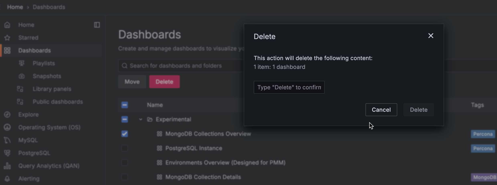

# Manage dashboard folders

This section describes how to delete multiple dashboards, move dashboards from one folder to another and navigate to a folder page where you can assign folder and dashboard permissions.

## Delete multiple dashboards

To delete multiple dashboards at once:

From the side menu, go to <i class="uil uil-apps"></i> **Dashboards**, browse for the dashboards that you want to delete, and click **Delete**.
{.power-number}

## Move dashboards from one folder to another
!!! note alert alert-primary "Note"
    You should have at least an **Editor** role to move a dashboard.

You can move dashboards from one folder to another in the following two ways:

1. From the side menu, go to <i class="uil uil-apps"></i> **Dashboards**, select the dashboards that you want to move then click **Move**.

The other way of moving dashboards from one folder to another is:
{.power-number}

1. On the **Dashboards** page, click on the dashboard that you want to move to another folder.
2. Click on <i class="uil uil-cog"></i> Dasboard settings icon at the top of the page.
3. On the **General** tab, use the **Folder** drop-down menu to select the new taget folder.
4. Click **Save Dashboard** on the the left to save the change.
   

## Navigate to a dashboard folder page to assign permissions

To navigate to a dashboard folder page to assign permissions:
{.power-number}

1. From the side menu, go to <i class="uil uil-apps"></i> **Dashboards** and click on the main folder whose permissions you want to set.
2. Click the **Folder actions > Manage permissions** button at the top-right of the page and select the requisite permission from the drop-down for the various roles.

    

