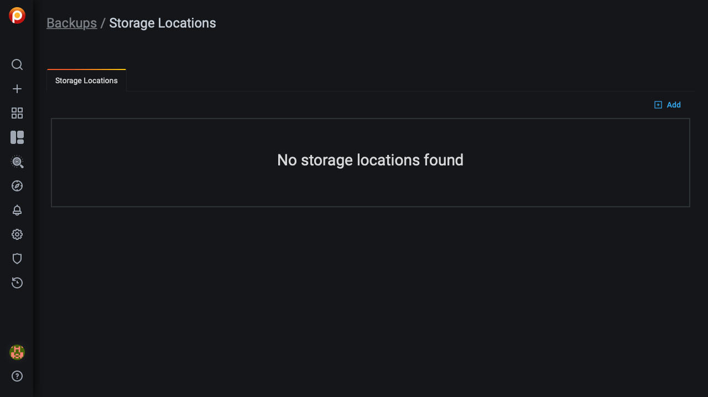
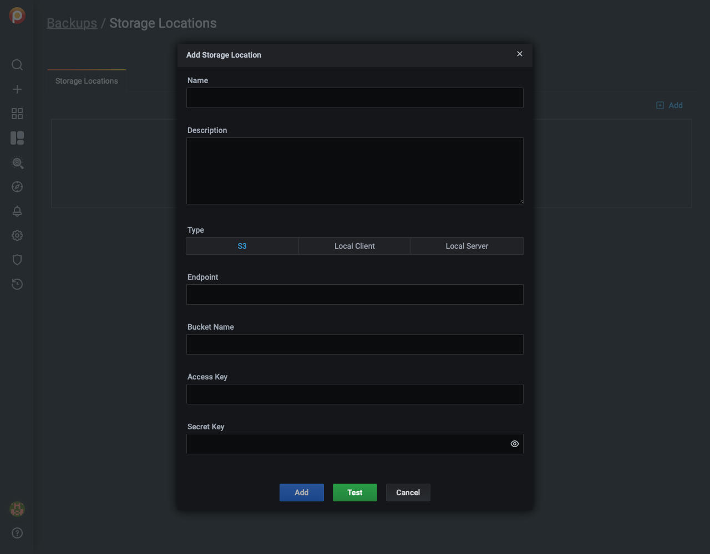

# Backup and Restore

!!! caution alert alert-warning "Caution"
    Backup and restore features are a technical preview and currently only work with MySQL or MongoDB database servers backing up to Amazon AWS S3 storage locations.

!!! summary alert alert-info "Summary"
    - Enable backup features.
    - Add a storage location.
    - Satisfy backup preconditions:
        - For MySQL:
            - Confirm instance service parameters and storage location.
            - Install required packages.

## Before you start

- You have an AWS S3 storage account and location details for it.

- Backup management has been enabled:

    1. Select <i class="uil uil-cog"></i> *Configuration* → <i class="uil uil-setting"></i> *Settings* → *Advanced Settings*.

    2. Activate *Backup Management*.

    3. Click *Apply changes*.

    4. Visit `<pmm-server-IP>/graph/backup` or click <i class="uil uil-history"></i> → *Backup* in the left menu bar.

        

    !!! note alert alert-primary ""
        If PMM Server runs as a Docker container, enable backup features at container creation time by adding `-e ENABLE_BACKUP_MANAGEMENT=1` to your `docker run` command.

## Add a storage location

1. Navigate to Backup Management → Storage locations.

2. Click *Add*.

3. Fill in the form fields.

    

    - *Name*:
    - *Description*:
    - *Type:*
        - *S3*:
        - *Local Client:* (Not currently implemented)
        - *Local Server:* (Not currently implemented)
    - *Endpoint:*
    - *Bucket Name:*
    - *Access Key:*
    - *Secret Key:*

4. Click *Add* to add the location or *Test* to test the connection.

## MySQL

### Preconditions

- There is only one MySQL instance running on the node.

- MySQL is running:

    - as a service via `systemd`;

    - with the name `mysql` (to confirm, use `systemctl status mysql`);

    - from a `mysql` system user account.

- There is a `mysql` system group.

- MySQL is using the `/var/lib/mysql` directory for database storage.

- The following packages are needed for creating backups. They should be included in the `$PATH` environment variable:

    - [`xtrabackup`][PERCONA_XTRABACKUP], which includes:

        - [`xbcloud`][PERCONA_XBCLOUD];

        - [`xbstream`][PERCONA_XBSTREAM];

    - [`qpress`][PERCONA_QPRESS].

    **The versions of each must be compatible with the installed version of MySQL.**

### Making a backup

1. Navigate to *Backup Management* → *Backup Inventory*.

2. Click <i class="uil uil-plus-square"></i> *Add*.

3. In the *Backup On Demand* dialog, enter values for:

    - *Service name* -- The service being backed up.
    - *Backup name* -- A unique name for the backup.
    - *Description* -- A long description.
    - *Location* -- The predefined storage location.

4. Click *Backup*.

5. In the *Backup Inventory* pane, watch the *Status* column.

### Restoring a backup

!!! note alert alert-primary ""
    For this release, you can only restore a backup to the same service. I.e. a MySQL backup of service `mysql-service-1` can only be restored to a MySQL database server registered with the same service name. Future releases will give more flexibility to restore backups to other service types.

1. Navigate to *Backup Management* → *Backup Inventory*.

2. Find the row with the backup you want to restore.

3. In the *Actions* column for that row, click *Restore from backup*.

4. In the *Restore from backup* dialog, check the values and click *Restore*.

5. Navigate to the *Restore History* tab to check the status of the restored backup.

## MongoDB

[PERCONA_XTRABACKUP]: https://www.percona.com/software/mysql-database/percona-xtrabackup
[PERCONA_XBCLOUD]: https://www.percona.com/doc/percona-xtrabackup/2.3/xbcloud/xbcloud.html
[PERCONA_XBSTREAM]: https://www.percona.com/doc/percona-xtrabackup/2.3/xbstream/xbstream.html
[PERCONA_QPRESS]: https://www.percona.com/doc/percona-xtrabackup/LATEST/backup_scenarios/compressed_backup.html
