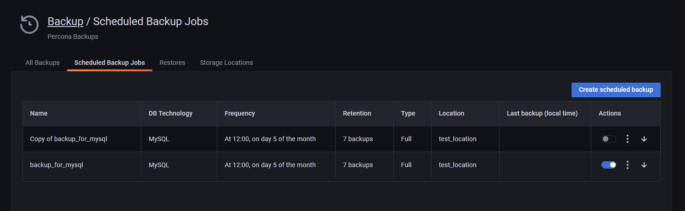
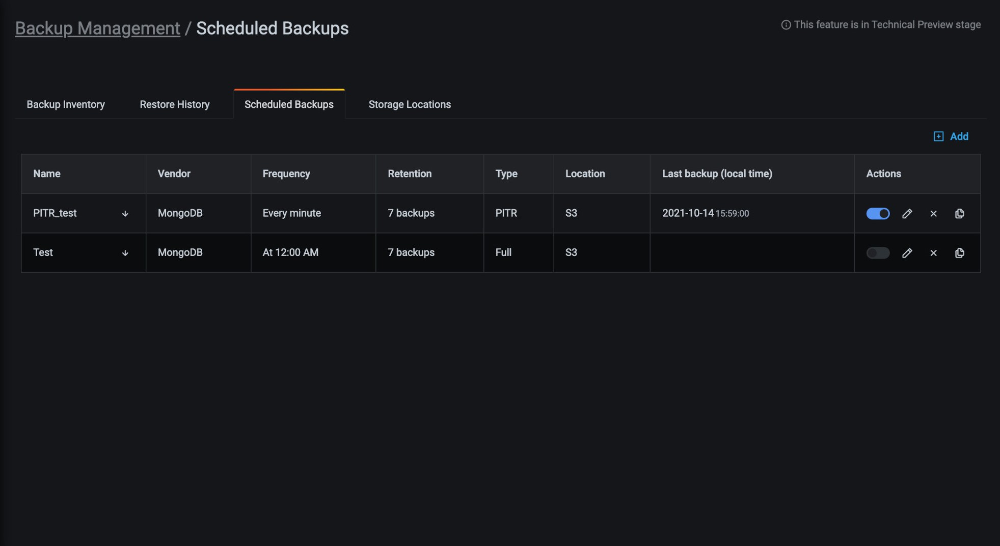
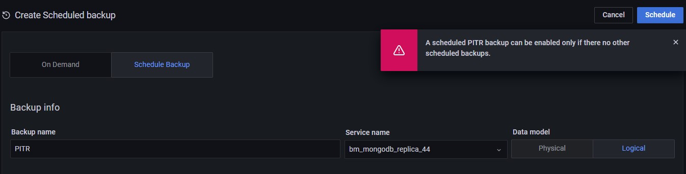

# Backup and restore

## Supported setups 
- Backups to Amazon AWS S3 and local storage locations 
- MySQL database server replica set cluster
- MongoDB replica set setups with the following actions:
  - **Logical snapshot backups**:  Create and Restore 
  - **Physical snapshot backups**: Create and Restore. This is only available with Percona Server for MongoDB and requires post-restore actions.
  -  **PITR backups**: Create both logical local and S3 backups. Restore only from S3.

## Prerequisites

### Enable Backup Management
  1. Go to  <i class="uil uil-cog"></i> **Configuration > PMM Settings > Advanced Settings** and activate the **Backup Management** option. 
  2. Click **Apply changes**. This adds the <i class="uil uil-history"></i> Backup option on the side menu.

    !!! caution alert alert-warning "Important"
      If PMM Server runs as a Docker container, enable backup features at container creation time by adding `-e ENABLE_BACKUP_MANAGEMENT=1` to your `docker run` command.

### [Prepare a storage location](#prepare-a-storage-location) 
#### For local backups
If you prefer storing your backup artifacts on a remote filesystem, make sure that you have Write permissions on the path you define, and that you've mounted the remote folder to all the mongoDB nodes. For more information, see the [Percona Backup for MongoDB (PBM) documentation](https://www.google.com/url?q=https://docs.percona.com/percona-backup-mongodb/details/storage-configuration.html%23remote-filesystem-server-storage&sa=D&source=docs&ust=1667855380308508&usg=AOvVaw3B1N4tjh_mv8lt4msbf3Ui). 

#### For Amazon AWS S3 backups
If you want to store backup artifacts in the cloud, make sure you have your Amazon S3 storage account and location details ready.
In addition to bucket location details, you will also need to ensure proper S3 permissions. 
The general minimum permissions are **LIST**/**PUT**/**GET**/**DELETE**. 
A sample IAM policy is:

        ```json
        {
            "Version": "2012-10-17",
            "Statement": [
                {
                    "Effect": "Allow",
                    "Action": [
                        "s3:ListBucket"
                    ],
                    "Resource": "arn:aws:s3:::pmm-backup-testing"
                },
                {
                    "Effect": "Allow",
                    "Action": [
                        "s3:PutObject",
                        "s3:PutObjectAcl",
                        "s3:GetObject",
                        "s3:GetObjectAcl",
                        "s3:DeleteObject"
                    ],
                    "Resource": "arn:aws:s3:::pmm-backup-testing/*"
                }
            ]
        }
        ```
   
## Create a storage location

1. Go to **Backup > Storage Locations**:
    

2. Click **Add storage location** and fill in a name and description for this new location.
3. Choose the type of storage location you are creating:
     - **S3**: Specify the Amazon AWS S3 backup location endpoint (URL), bucket name, and connection details. 
     - **Local Client**: specify the path on your local client for files to be backed up to.

4. Optionally, click **Test** to test the connection.

5.  Click **Add** to create the location.

## MySQL backup prerequisites

To be able to create MySQL backups, make sure that:

- [PMM Client](../setting-up/client/index.md) is installed and running on the node.

- For MySQL 8.0+, the user that pmm-agent uses to connect to MySQL must have the BACKUP_ADMIN privilege for Xtrabackup to work.

- There is only one MySQL instance running on the node.

- MySQL is running:

    - as a service via `systemd`;

    - with the name `mysql` or `mysqld` (to confirm, use `systemctl status mysql` or `systemctl status mysqld` respectively);

    - from a `mysql` system user account.

- There is a `mysql` system group.

- MySQL is using the `/var/lib/mysql` directory for database storage.

- `pmm-agent` has read/write permissions to the `/var/lib/mysql` directory.

- The latest versions of the following packages are installed. They should be included in the `$PATH` environment variable:

    - [`xtrabackup`][PERCONA_XTRABACKUP], which includes:

        - [`xbcloud`][PERCONA_XBCLOUD];

        - [`xbstream`][PERCONA_XBSTREAM];

    - [`qpress`][PERCONA_QPRESS].

    !!! caution alert alert-warning "Important"
        The versions of each must be compatible with the installed version of MySQL.

## MongoDB backup prerequistes

Before creating MongoDB backups, make sure that:
- [Percona Backup for MongoDB] (PBM) is installed and `pbm-agent` is running on all MongoDB nodes in the replica set. PMM 2.32 and later require PBM 2.0.1 or newer.
- MongoDB is a member of a replica set.
- Check out the current [supported configurations and limitations](mongodb_limitations.md).

## Make a backup

To create a backup:
1. Go to  <i class="uil uil-history"></i> **Backup > All Backups**.
2. Click <i class="uil uil-plus-square"></i> **Create Backup**.
3. Specify the type of backup that you want to create: **On Demand** or **Schedule Backup**.
4. Enter a unique name for this backup.
5. Choose the service to back up from the Service name drop-down menu. This automatically populates the **DB Technology** field.
6. Select whether you want to create a physical or logical backup of your data, depending on your use case and requirements.
7. Choose a storage location for the backup. If no options are available here, see the [Prepare a storage location](#prepare-a-storage-location) 
 section above.
8. For schedule backups, also add a backup description specify a schedule and retention policy for the backup. If you wand to keep backup artifacts number of artifacts, type `0` (zero).
9.  Expand **Advanced Settings** to specify the settings for retrying the backup in case of any issues. You can either let PMM retry the backup again ("Auto") or do it again yourself ("Manual").
"Auto" retry mode enables you to select up to ten retries and an interval of up to eight hous between retries. 
10.  Click **Backup** to start creating the backup artifact.
11.  Go to the **All Backups** tab, and check the **Status** column. An animated ellipsis indicator {{icon.bouncingellipsis}} shows activity in progress.

## Edit a scheduled backup

1. Go to **Backup > Scheduled Backup Jobs**.
2. In the *Actions* column:
    - Click the switch <i class="uil uil-toggle-on"></i> to enable or disable the backup.
    - Click  to edit, delete or create a (by default, disabled) copy of the backup schedule.

        

## MongoDB Point-In-Time-Recoverable Backups

!!! caution alert alert-warning "Caution"
    - MongoDB Point-In-Time-Recoverable Backups is part of Backup Management which is a [technical preview](../details/glossary.md#technical-preview) feature.

### What is it?

Better described by our team mates that develop Percona Backup for MongoDB:

!!! note alert alert-primary ""
    Point-in-Time Recovery is restoring a database up to a specific moment. Point-in-Time Recovery includes restoring the data from a backup snapshot and replaying all events that occurred to this data up to a specified moment from [oplog slices]. Point-in-Time Recovery helps you prevent data loss during a disaster such as crashed database, accidental data deletion or drop of tables, unwanted update of multiple fields instead of a single one.

Point-In-Time-Recovery (PITR) Backups for MongoDB is new functionality available with PMM 2.23.0 as part of the larger Backup Management feature. This implementation in PMM uses Percona Backup for MongoDB `pbm >= 1.6.0` behind the scenes.

!!! caution alert alert-warning ""
    - Percona Backup for MongoDB is a distributed, low-impact solution for achieving consistent backups of MongoDB sharded clusters and replica sets. Percona Backup for MongoDB supports [Percona Server for MongoDB] and MongoDB Community v3.6 or higher with [MongoDB Replication] enabled. Learn more about [Percona Backup for MongoDB].

### How does it work?

#### Enabling PITR

The very first thing you want to do is to enable PITR. Here’s how:

1. Go to *Backup Management*.
1. Select *Scheduled Backups*.
1. Click on *Add* to create a new scheduled backup.
1. Click on the PITR button to enable Point-In-Time-Recovery.

    

Once you’ve enabled PITR, head to the list of Scheduled Backups to confirm PITR is enabled.



To disable PITR use the corresponding switch available on the list.

#### PITR Artifacts

The PITR artifacts will be available once your PITR job has run for the first time. Go to Backup Inventory to see the corresponding PITR artifact.


#### PITR and Other Scheduled Backups

It is important to notice that enabling PITR requires any other scheduled backup jobs to be disabled. If you try to enable PITR while other scheduled backup jobs are active, you will be shown an error message as seen in the image below.



Go ahead to manually disable the existing scheduled jobs, then you’ll be able to enable PITR.

The above constraint applies at the service level. That said, you can still have PITR enabled for one service while having regular scheduled backup jobs for other services.

## Restore a backup

!!! note alert alert-primary ""
  MySQL backups can be restored to the same service it was created from, or to a compatible one. MongoDB backups   can only be restored to the same service it was created from. 

1. Select <i class="uil uil-history"></i> → *Backup* → *Backup Inventory*.

1. Find the row with the backup you want to restore.

1. In the *Actions* column for that row, click *Restore from backup*.

1. In the *Restore from backup* dialog:

    - Select *Same service* to restore to a service with identical properties.
        - Select the service in the *Service name* menu.

    - Select *Compatible services* to restore to a compatible service.
        - Select the compatible service in the *Service name* menu.

1. Check the values and click *Restore*.

1. Navigate to the *Restore History* tab to check the status of the restored backup.

## Delete a backup

1. Select <i class="uil uil-history"></i> → *Backup* → *Backup Inventory*.

1. Find the row with the backup you want to delete.

1. In the *Actions* column for that row, click *Delete backup*.

1. (Optional) Check *Delete from storage* to also delete the actual backup content besides just the backup register.

1. Click *Delete* to proceed.

[Amazon AWS S3]: https://aws.amazon.com/s3/
[Percona Backup for MongoDB]: https://www.percona.com/doc/percona-backup-mongodb/installation.html
[PERCONA_QPRESS]: https://www.percona.com/doc/percona-xtrabackup/LATEST/backup_scenarios/compressed_backup.html
[PERCONA_XBCLOUD]: https://www.percona.com/doc/percona-xtrabackup/2.3/xbcloud/xbcloud.html
[PERCONA_XBSTREAM]: https://www.percona.com/doc/percona-xtrabackup/2.3/xbstream/xbstream.html
[PERCONA_XTRABACKUP]: https://www.percona.com/software/mysql-database/percona-xtrabackup
[Add a storage location]: #add-a-storage-location
[oplog slices]: https://www.percona.com/doc/percona-backup-mongodb/glossary.html#term-oplog-slice
[Percona Server for MongoDB]: https://www.percona.com/software/mongo-database/percona-server-for-mongodb
[MongoDB Replication]: https://docs.mongodb.com/manual/replication/
