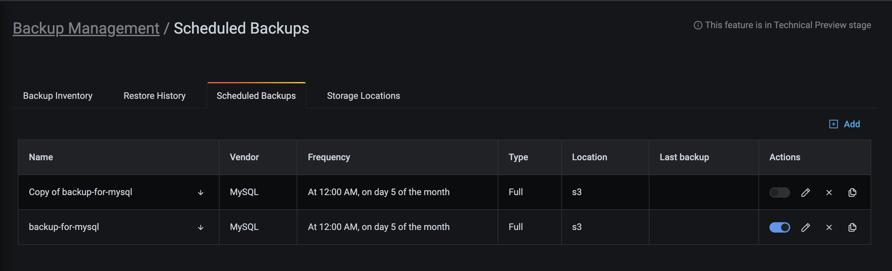

## Supported setups 

!!! caution alert alert-warning "Important"
    MySQL backup functionality is still Technical Preview
    
PMM supports MySQL database server (Technical Preview) for:
    
  - Creating and restoring physical backups
  - Storing backups to Amazon S3-compatible object storage  

### Backup prerequisites

### Enable Backup Management
  1. Go to  <i class="uil uil-cog"></i> **Configuration > PMM Settings > Advanced Settings** and activate the **Backup Management** option. 
  2. Click **Apply changes**. This adds the <i class="uil uil-history"></i> Backup option on the side menu.

3.  !!! caution alert alert-warning "Important"
    If PMM Server runs as a Docker container, enable backup features at container creation time by adding `-e ENABLE_BACKUP_MANAGEMENT=1` to your `docker run` command.

4. Check that the  [PMM Client](../setting-up/client/index.md) is installed and running on the node.

5. To enable Xtrabackup for MySQL 8.0+, check that pmm-agent connects to MySQL wit a user that has  BACKUP_ADMIN privilege. 

6. Check that there is only one MySQL instance running on the node.

7. Verify that MySQL is running:

    - as a service via `systemd`;

    - with the name `mysql` or `mysqld` (to confirm, use `systemctl status mysql` or `systemctl status mysqld` respectively);

    - from a `mysql` system user account.

8. Make sure that there is a `mysql` system group.

9. Check that MySQL is using the `/var/lib/mysql` directory for database storage.

10. Make sure that `pmm-agent` has read/write permissions to the `/var/lib/mysql` directory.

11. Check that the latest versions of the following packages are installed and included in the `$PATH` environment variable:

    - [`xtrabackup`][PERCONA_XTRABACKUP], which includes:

        - [`xbcloud`][PERCONA_XBCLOUD];

        - [`xbstream`][PERCONA_XBSTREAM];

    - [`qpress`][PERCONA_QPRESS].

!!! caution alert alert-warning "Important"
       The versions of each must be compatible with the installed version of MySQL.

## [Make a backup](#make-a-backup)

To create a backup:

1. Go to  <i class="uil uil-history"></i> **Backup > All Backups**.
2. Click <i class="uil uil-plus-square"></i> **Create Backup**.
3. Specify the type of backup that you want to create: **On Demand** or **Schedule Backup**.
4. Enter a unique name for this backup.
5. Choose the service to back up from the Service name drop-down menu. This automatically populates the **DB Technology** field.
6. Select whether you want to create a **Physical** or **Logical** backup of your data, depending on your use case and requirements. For MySQL, only the **Physical** data model is available.
7. Choose a storage location for the backup. MySQL currently only supports storing backups to Amazon S3. If no options are available here, see the [Create a storage location](#create-a-storage-location) section above.
8. If you're creating a schedule backups, also specify the backup type, the schedule, and a retention policy for your backup:
    - **Backup Type**: currently, PMM only supports  **Full** backup types for MySQL. 
    - **Shedule**: configure the frequency and the start time for this backup. Make sure that the the schedule you specify here does not create overlapping jobs or overhead on the production environment. Also check that your specified shedule does not overlap with production hours.
    - **Retention**: this option is only available for Snapshot backups stored on Amazon S3. If you wand to keep an unlimited number of backup artifacts, type `0`.
9. Expand **Advanced Settings** to specify the settings for retrying the backup in case of any issues. You can either let PMM retry the backup again (**Auto**), or do it again yourself **Manual**. Auto retry mode enables you to select up to ten retries and an interval of up to eight hours between retries.
10. Click **Backup** to start creating the backup artifact or schedule a job.
11. Go to the **All Backups** tab, and check the **Status** column. An animated ellipsis indicator {{icon.bouncingellipsis}} shows that a backup is currently being created.

## Edit a scheduled backup

1. Go to **Backup > Scheduled Backup Jobs**.
2. In the **Actions** column:
    - Click the switch <i class="uil uil-toggle-on"></i> to enable or disable the backup.
    - Click  to edit, delete or create a (by default, disabled) copy of the backup schedule.

 

## Restore a backup

### Restore compatibility
MySQL backups can be restored to the same service it was created from, or to a compatible one. MongoDB backups can only be restored to the same service they were created from.

To restore a backup:

1. Go to <i class="uil uil-history"></i> **Backup > All backups** and find the backup that you want to restore.
2. Click the arrow in the **Actions** column to check all the information for the backup, then click  **> Restore from backup**.
3. In the **Restore from backup** dialog, select **Same service** to restore to a service with identical properties or **Compatible services** to restore to a compatible service.
4. Select one of the available service names from the drop-down menu.
5. Check the values, then click **Restore**.
6. Go to the **Restores** tab to check the status of the restored backup.
During restoring, PMM disables all the scheduled backup tasks for the current service. Remember to re-enable them manually after the restore.

## Delete a backup
You can only delete backup artifacts stored on Amazon S3. Local backups must be removed manually.

To delete a backup:

1. Go to  <i class="uil uil-history"></i> **Backup > All Backups** and find the row with the backup you want to delete.
2. Click the arrow in the **Actions** column to check all the information for the backup, then click  **> Delete backup**.
3. In the Delete backup artifact dialog box, enable **Delete from storage** if you also want to delete the actual backup content besides just the backup register.
4. Click **Delete**.