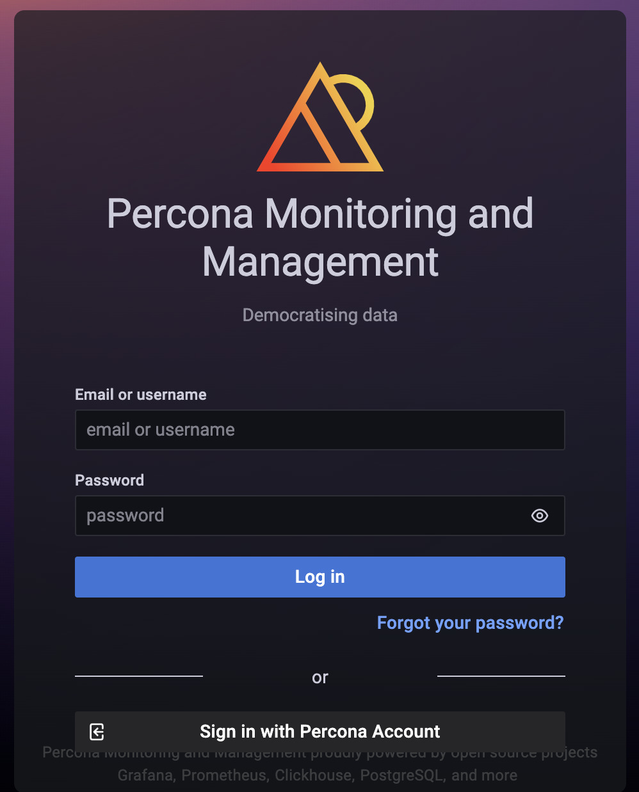
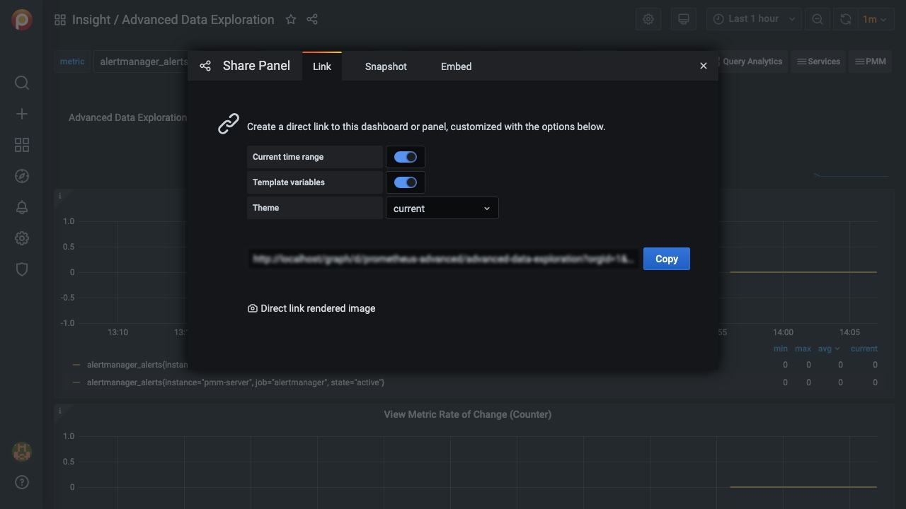
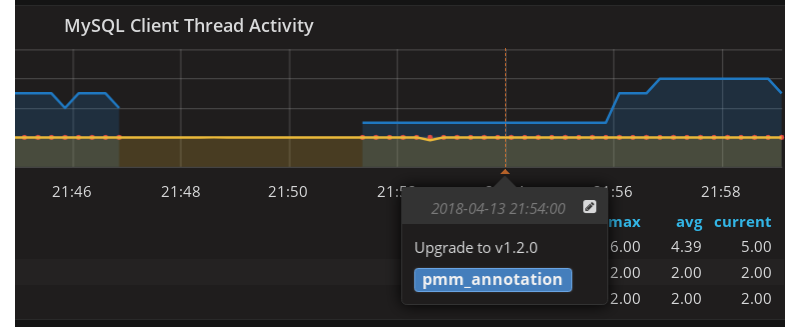

# User Interface

PMM's user interface is a browser application based on Grafana.

---

[TOC]

---

## Dashboards

The interface is a collection of web pages called *dashboards*.

There are three types:

- **Metrics** pages that show metrics for connected clients;
- **Application** pages, specialized for functions such as *Query Analytics*;
- **Utility** pages, such as *PMM Settings*, for administration and configuration.

## Logging in

1. Start a web browser and enter the server name or IP address of the PMM server host.

    

2. Enter the username and password given to you by your system administrator.

    The defaults are:

    - Username: `admin`
    - Password: `admin`

3. Click *Log in*

4. If this is your first time logging in, you'll be asked to set a new password. (We recommend you do.) Enter a new password in both fields and click *Submit*.

5. If you wish, you can click *Skip* and continue using the default password.

6. The PMM Home dashboard loads.

    

## Common page elements

### Top row menu bar


| Items (left)   |   |                           |
| --------------:| - | ------------------------- |
| {{icon.apps}}  |   | (Display only)            |
| (Name) /       |   | (Optional) Folder name    |
| (Name)         |   | Dashboard name            |
| {{icon.star}}  |   | Mark as favorite          |
| {{icon.share}} |   | Share dashboard           |
|                |   |                           |

| Items (right)                 |   |                       |
| -----------------------------:| - | --------------------- |
| {{icon.cog}}                  |   | Dashboard settings    |
| {{icon.monitor}}              |   | Cycle view mode       |
| {{icon.clock9}} (time range)  |   | Time range selector   |
| {{icon.searchminus}}          |   | Time range zoom out   |
| {{icon.sync}}                 |   | Refresh dashboard     |
| (Time interval)               |   | Refresh period        |

### Second row menu bar


| Items (left)  |   |                        |
| -------------:| - | ---------------------- |
| Interval      |   | Data interval          |
| Environment   |   | Filter by environment  |
| Node name     |   | Filter by node name    |

| Items (right)                 |   |                    |
| -----------------------------:| - | ------------------ |
| {{icon.filealt}} Home         |   | Home               |
| {{icon.apps}} Query Analytics |   | Query Analytics    |
| {{icon.bars}} Services        |   | Services           |
| {{icon.bars}} PMM             |   | PMM menu           |

### Vertical menu bar

The vertical menu bar (left) is part of the Grafana framework and is visible on every page.


| Items (Top)       |   |               |
|:-----------------:| - | ------------- |
| {{icon.percona}}  |   | Home          |
| {{icon.search}}   |   | Search        |
| {{icon.plus}}     |   | Create        |
| {{icon.apps}}     |   | Dashboards    |
| {{icon.compass}}  |   | Explore       |
| {{icon.bell}}     |   | Alerting      |
| {{icon.cog}}      |   | Configuration |
| {{icon.shield}}   |   | Server Admin  |
| {{icon.database}} |   | DBaaS         |

!!! alert alert-info "Note"
    The DBaaS icon appears only if a server feature flag has been set.

| Icons (Bottom)           |   |           |
|:------------------------:| - | --------- |
| (Profile icon)           |   | User menu |
| {{icon.questioncircle}}  |   | Help      |


## Opening a Dashboard

The default PMM installation provides more than thirty dashboards. To make it
easier to reach a specific dashboard, the system offers two tools. The
*Dashboard Dropdown* is a button in the header of any PMM page. It lists
all dashboards, organized into folders. Right sub-panel allows to rearrange
things, creating new folders and dragging dashboards into them. Also a text box
on the top allows to search the required dashboard by typing.

With *Dashboard Dropdown*, search the alphabetical list for any dashboard.


## Viewing More Information about a Graph

Each graph has a descriptions to display more information about the monitored
data without cluttering the interface.

These are on-demand descriptions in the tooltip format that you can find by
hovering the mouse pointer over the *More Information* icon at the top left
corner of a graph. When you move the mouse pointer away from the *More Information*
button the description disappears.

Graph descriptions provide more information about a graph without claiming any space in the interface.


## Rendering Dashboard Images

PMM Server can't currently directly render dashboard images exported by Grafana without these additional set-up steps.

**Part 1: Install dependencies**

1. Connect to your PMM Server Docker container.

    ```sh
    docker exec -it pmm-server bash
    ```

2. Install Grafana plugins.

    ```sh
    grafana-cli plugins install grafana-image-renderer
    ```

3. Restart Grafana.

    ```sh
    supervisorctl restart grafana
    ```

4. Install additional libraries.

    ```sh
    yum install -y libXcomposite libXdamage libXtst cups libXScrnSaver pango atk adwaita-cursor-theme adwaita-icon-theme at at-spi2-atk at-spi2-core cairo-gobject colord-libs dconf desktop-file-utils ed emacs-filesystem gdk-pixbuf2 glib-networking gnutls gsettings-desktop-schemas gtk-update-icon-cache gtk3 hicolor-icon-theme jasper-libs json-glib libappindicator-gtk3 libdbusmenu libdbusmenu-gtk3 libepoxy liberation-fonts liberation-narrow-fonts liberation-sans-fonts liberation-serif-fonts libgusb libindicator-gtk3 libmodman libproxy libsoup libwayland-cursor libwayland-egl libxkbcommon m4 mailx nettle patch psmisc redhat-lsb-core redhat-lsb-submod-security rest spax time trousers xdg-utils xkeyboard-config alsa-lib
    ```

**Part 2 - Share your dashboard image**

1. Navigate to the dashboard you want to share.

2. Open the panel menu (between the PMM main menu and the navigation breadcrumbs).

    

3. Select *Share* to reveal the *Share Panel*.

    

4. Click *Direct link rendered image*.

5. A new browser tab opens. Wait for the image to be rendered then use your browser's image save function to download the image.


If the necessary plugins are not installed, a message in the Share Panel will say so.


## Navigating across Dashboards

Beside the *Dashboard Dropdown* button you can also Navigate across
Dashboards with the navigation menu which groups dashboards by
application. Click the required group and then select the dashboard
that matches your choice.

* PMM Query Analytics
* OS: The operating system status
* MySQL: MySQL and Amazon Aurora
* MongoDB: State of MongoDB hosts
* HA: High availability
* Cloud: Amazon RDS and Amazon Aurora
* Insight: Summary, cross-server and Prometheus
* PMM: Server settings


## Zooming in on a single metric

On dashboards with multiple metrics, it is hard to see how the value of a single
metric changes over time. Use the context menu to zoom in on the selected metric
so that it temporarily occupies the whole dashboard space.

Click the title of the metric that you are interested in and select the
*View* option from the context menu that opens.


The selected metric opens to occupy the whole dashboard space. You may now set
another time range using the time and date range selector at the top of the
Metrics Monitor page and analyze the metric data further.


To return to the dashboard, click the *Back to dashboard* button next to the time range selector.

The *Back to dashboard* button returns to the dashboard; this button appears when you are zooming in on one metric.


Navigation menu allows you to navigate between dashboards while maintaining the
same host under observation and/or the same selected time range, so that for
example you can start on *MySQL Overview* looking at host serverA, switch to
MySQL InnoDB Advanced dashboard and continue looking at serverA, thus saving you
a few clicks in the interface.


## Annotations

The `pmm-admin annotate` command registers a moment in time, marking it with a text string called an *annotation*.

The presence of an annotation shows as a vertical dashed line on a dashboard graph; the annotation text is revealed by mousing over the caret indicator below the line.

Annotations are useful for recording the moment of a system change or other significant application event.

They can be set globally or for specific nodes or services.



**USAGE**

`pmm-admin annotate [--node|--service] <annotation> [--tags <tags>] [--node-name=<node>] [--service-name=<service>]`

**OPTIONS**

`<annotation>`
: The annotation string. If it contains spaces, it should be quoted.

`--node`
: Annotate the current node or that specified by `--node-name`.

`--service`
: Annotate all services running on the current node, or that specified by `--service-name`.

`--tags`
: A quoted string that defines one or more comma-separated tags for the annotation. Example: `"tag 1,tag 2"`.

`--node-name`
: The node name being annotated.

`--service-name`
: The service name being annotated.

### Combining flags

Flags may be combined as shown in the following examples.

`--node`
: current node

`--node-name`
: node with name

`--node --node-name=NODE_NAME`
: node with name

`--node --service-name`
: current node and service with name

`--node --node-name --service-name`
: node with name and service with name

`--node --service`
: current node and all services of current node

`-node --node-name --service --service-name`
: service with name and node with name

`--service`
: all services of the current node

`--service-name`
: service with name

`--service --service-name`
: service with name

`--service --node-name`
: all services of current node and node with name

`--service-name --node-name`
: service with name and node with name

`--service --service-name -node-name`
: service with name and node with name

!!! note
    If node or service name is specified, they are used instead of other parameters.

### Visibility

You can toggle the display of annotations on graphs with the *PMM Annotations* checkbox.


Remove the check mark to hide annotations from all dashboards.

!!! seealso "See also"

    * [docs.grafana.org: Annotations](http://docs.grafana.org/reference/annotations/)
