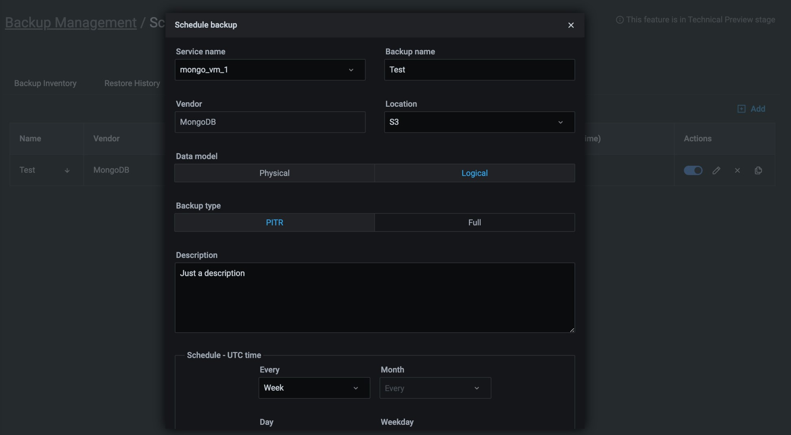
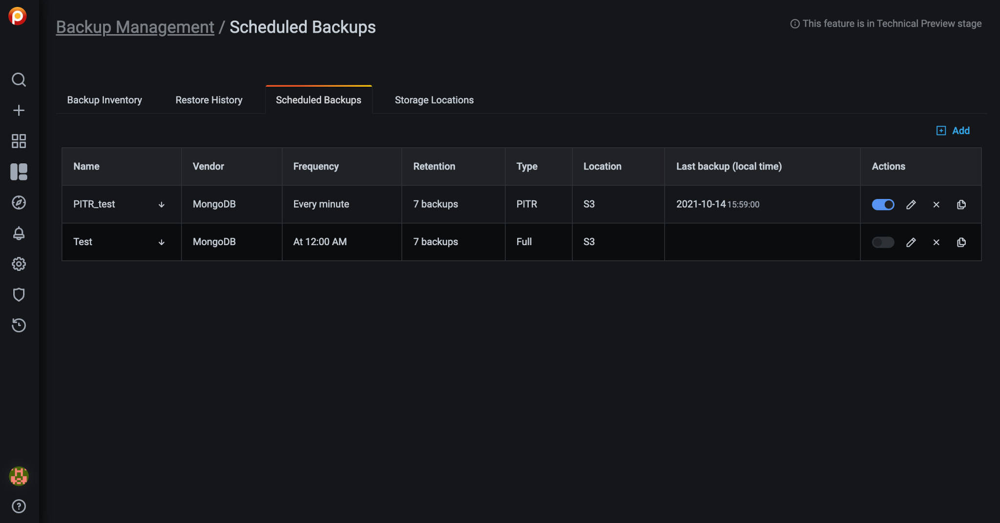
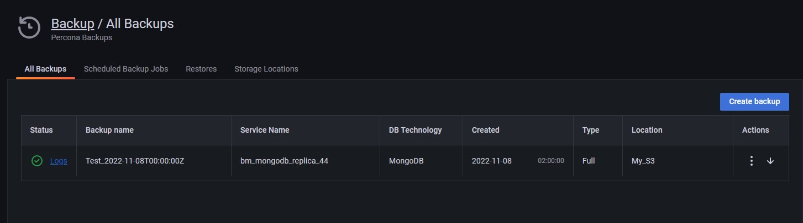
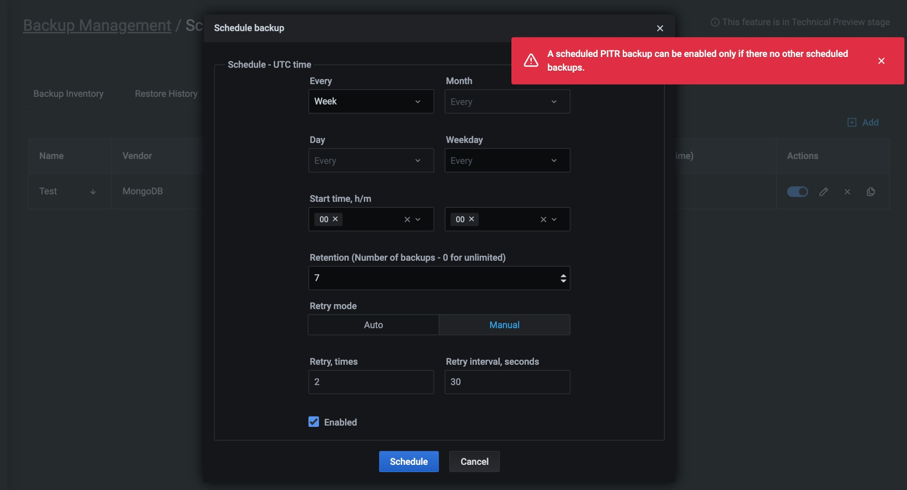

# MongoDB Point-In-Time-Recoverable Backups

!!! caution alert alert-warning "Caution"
    - MongoDB Point-In-Time-Recoverable Backups is part of Backup Management which is a [technical preview](../details/glossary.md#technical-preview) feature.
    - Currently supported: MongoDB replica set cluster, backing up to Amazon AWS S3 storage locations.
    
!!! summary alert alert-info "Summary"
    - [What is it?](#what-is-it).
    - [How does it work?](#how-does-it-work)
    
## What is it?

Better described by our team mates that develop Percona Backup for MongoDB:

!!! note alert alert-primary ""
    Point-in-Time Recovery is restoring a database up to a specific moment. Point-in-Time Recovery includes restoring the data from a backup snapshot and replaying all events that occurred to this data up to a specified moment from [oplog slices]. Point-in-Time Recovery helps you prevent data loss during a disaster such as crashed database, accidental data deletion or drop of tables, unwanted update of multiple fields instead of a single one.
    
Point-In-Time-Recovery (PITR) Backups for MongoDB is new functionality available with PMM 2.23.0 as part of the larger Backup Management feature. This implementation in PMM uses Percona Backup for MongoDB `pbm >= 1.6.0` behind the scenes.

    !!! caution alert alert-warning ""
        Percona Backup for MongoDB is a distributed, low-impact solution for achieving consistent backups of MongoDB sharded clusters and replica sets. Percona Backup for MongoDB supports [Percona Server for MongoDB] and MongoDB Community v3.6 or higher with [MongoDB Replication] enabled. Learn more about [Percona Backup for MongoDB].
        
## How does it work?

#### Enabling PITR

The very first thing you want to do is to enable PITR. Here’s how:

1. Go to *Backup Management*.
1. Select *Scheduled Backups*.
1. Click on *Add* to create a new scheduled backup.
1. Click on the PITR button to enable Point-In-Time-Recovery.

    
    
Once you’ve enabled PITR, head to the list of Scheduled Backups to confirm PITR is enabled.

    
    
To disable PITR use the corresponding switch available on the list.

#### PITR Artifacts

The PITR artifacts will be available once your PITR job has run for the first time. Go to Backup Inventory to see the corresponding PITR artifact.

#### PITR and Other Scheduled Backups

It is important to notice that enabling PITR requires any other scheduled backup jobs to be disabled. If you try to enable PITR while other scheduled backup jobs are active, you will be shown an error message as seen in the image below.

Go ahead to manually disable the existing scheduled jobs, then you’ll be able to enable PITR.

The above constraint applies at the service level. That said, you can still have PITR enabled for one service while having regular scheduled backup jobs for other services.

[oplog slices]: https://www.percona.com/doc/percona-backup-mongodb/glossary.html#term-oplog-slice
[Percona Server for MongoDB]: https://www.percona.com/software/mongo-database/percona-server-for-mongodb
[MongoDB Replication]: https://docs.mongodb.com/manual/replication/
[Percona Backup for MongoDB]: https://www.percona.com/doc/percona-backup-mongodb/installation.html
