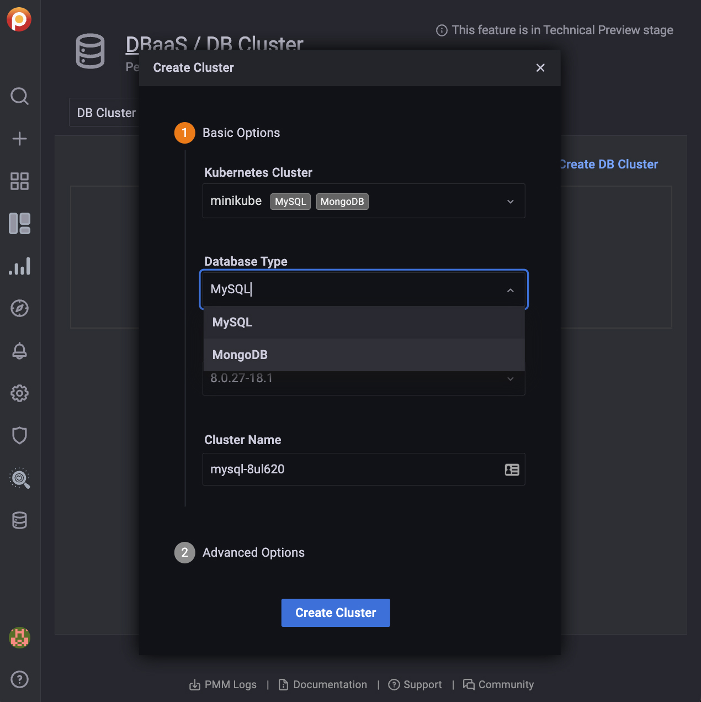
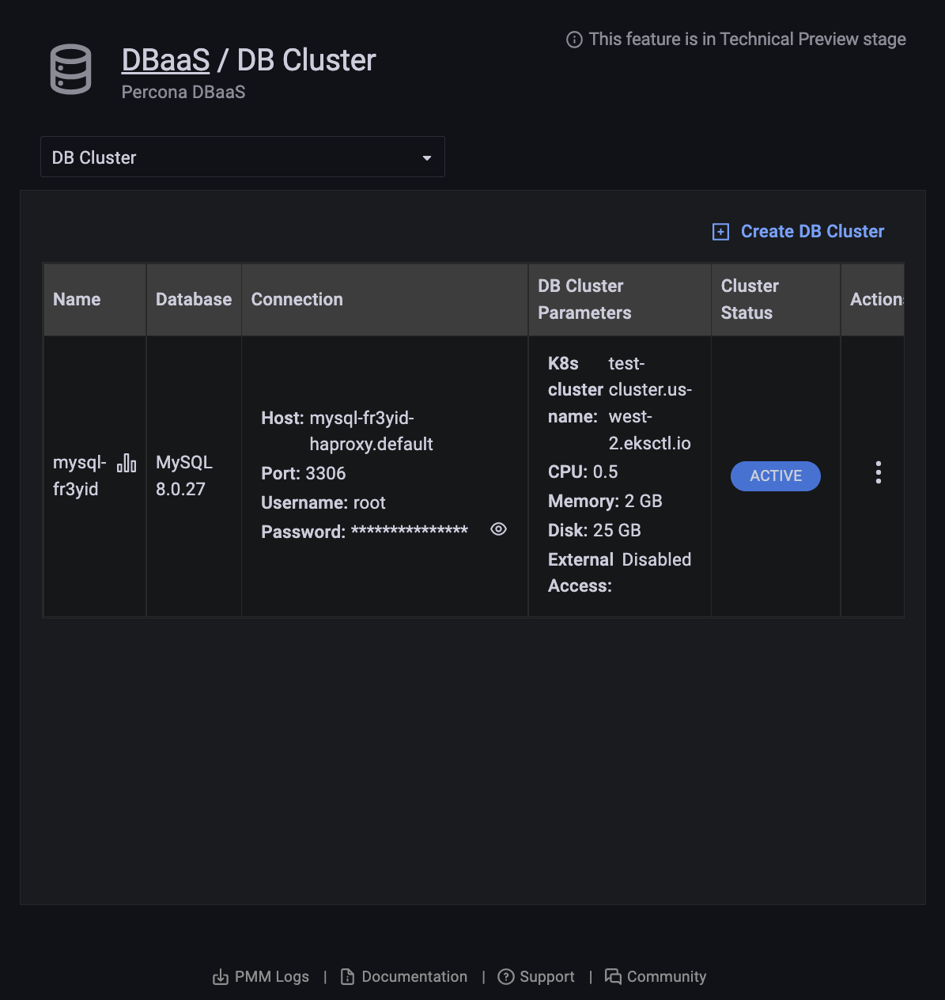

# DBaaS Dashboard

!!! alert alert-warning "Caution"
    DBaaS functionality is Alpha. The information on this page is subject to change and may be inaccurate.

!!! alert alert-info "Note"
    You must run PMM Server with a DBaaS feature flag to activate the features described here.

---

[TOC]

---

The DBaaS dashboard is where you add, remove, and operate on Kubernetes and database clusters.

To open the DBaaS dashboard:

- From the main menu, select {{ icon.bars }} *PMM* --> *PMM DBaaS*;
- Or, from the left menu, select {{ icon.database }} *DBaaS*.

## Kubernetes clusters

### Add a Kubernetes cluster

1. Click *Register new Kubernetes Cluster*

2. Enter values for the *Kubernetes Cluster Name* and *Kubeconfig file* in the corresponding fields.

    

3. Click *Register*.

4. A message will momentarily display telling you whether the registration was successful or not.

    

### Unregister a Kubernetes cluster

!!! alert alert-info "Note"
    You can't unregister a Kubernetes cluster if there DB clusters associated with it.

1. Click *Unregister*.

2. Confirm the action by clicking *Proceed*, or abandon by clicking *Cancel*.

### View a Kubernetes cluster's configuration

1. Find the row with the Kubernetes cluster you want to see.

2. In the *Actions* column, open the {{ icon.ellipsisv }} menu and click *Show configuration*.

## DB clusters

### Add a DB Cluster

!!! alert alert-info "Note"
    You must create at least one Kubernetes cluster to create a DB cluster.

!!! alert alert-info "Note"
    If you want to have your future DB Cluster monitored by PMM you need to set up [Public Address](https://www.percona.com/doc/percona-monitoring-and-management/2.x/how-to/configure.html#public-address) for your PMM Server before creating the cluster

!!! alert alert-success "Tip"
    Resource consumption in Kubernetes can cause problems. Use this formula to ensure your nodes have enough resources to start the requested configuration:

    > ( 2 * # of nodes in DB cluster * CPU per node ) + (.5 * # of nodes in db cluster) = total # of CPUs that must be free for cluster to start

	The first part of the equation is resources for the cluster. It is doubled because each DB cluster member must also have a proxy started with it.

    The second part is to start the container(s) that automatically monitor each member of the DB cluster.

	(You can also specify CPU in decimal tenths, e.g. `.1` CPUs or `1.5` CPUs.)

1. Select the *DB Cluster* tab.

    

2. Click *Create DB Cluster*.

3. In section 1, *Basic Options*:

    1. Enter a value for *Cluster name* that complies with domain naming rules.

    2. Select a cluster from the *Kubernetes Cluster* menu.

    3. Select a database type from the *Database Type* menu.

        

4. Expand section 2, *Advanced Options*.

    1. Select *Topology*, either *Cluster* or *Single Node*.

    2. Select the number of nodes. (The lower limit is 3.)

    3. Select a preset for *Resources per Node*.

        *Small*, *Medium* and *Large* are fixed preset values for *Memory*, *CPU*, and *Disk*.

        Values for the *Custom* preset can be edited.

        

5. When both *Basic Options* and *Advanced Options* section icons are green, the *Create Cluster* button becomes active. (If it is inactive, check the values for fields in sections whose icon is red.)

    Click *Create Cluster* to create your cluster.

6. A row appears with information on your cluster:

    

    - *Name*: The cluster name
    - *Database type*: The cluster database type
    - *Connection*:
        - *Host*: The hostname
        - *Port*: The port number
        - *Username*: The connection username
        - *Password*: The connection password (click the eye icon {{ icon.eye }} to reveal)
    - *DB Cluster Parameters*:
        - *K8s cluster name*: The Kubernetes cluster name
        - *CPU*: The number of CPUs allocated to the cluster
        - *Memory*: The amount of memory allocated to the cluster
        - *Disk*: The amount of disk space allocated to the cluster
    - *Cluster Status*:
        - *PENDING*: The cluster is being created
        - *ACTIVE*: The cluster is active
        - *FAILED*: The cluster could not be created
        - *DELETING*: The cluster is being deleted

### Delete a DB Cluster

1. Find the row with the database cluster you want to delete.

2. In the *Actions* column, open the {{ icon.ellipsisv }} menu and click *Delete*.

3. Confirm the action by clicking *Proceed*, or abandon by clicking *Cancel*.

    

### Edit a DB Cluster

1. Select the *DB Cluster* tab.

2. Find the row with the database cluster you want to change.

3. In the *Actions* column, open the {{ icon.ellipsisv }} menu and click *Edit*.

A paused cluster can't be edited.

### Restart a DB Cluster

1. Select the *DB Cluster* tab.

2. Identify the database cluster to be changed.

3. In the *Actions* column, open the {{ icon.ellipsisv }} menu and click *Restart*.

### Suspend or resume a DB Cluster

1. Select the *DB Cluster* tab.

2. Identify the DB cluster to suspend or resume.

3. In the *Actions* column, open the {{ icon.ellipsisv }} menu and click the required action:

    - For active clusters, click *Suspend*.

        

    - For paused clusters, click *Resume*.

        

!!! seealso "See also"
    [Setting up a development environment for DBaaS](../../setting-up/server/dbaas.md)
