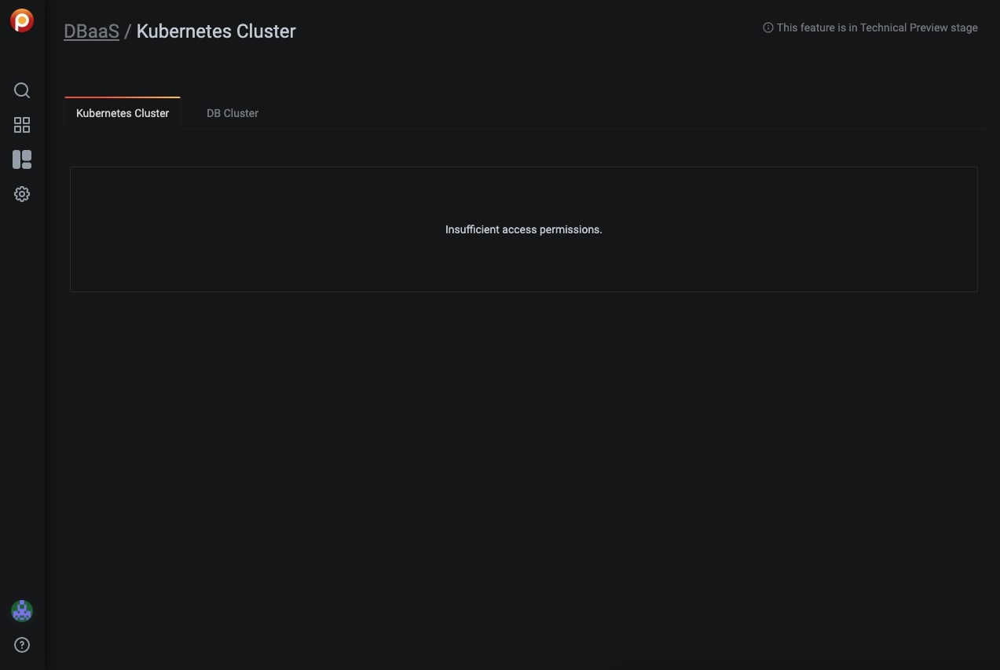

# About Percona Platform

Percona Platform provides value-added services to PMM.

The services comprise:

- [Security Threat Tool](security-threat-tool.md)
- [DBaaS](dbaas.md) 

Currently some Percona Platform features are only available for PMM Admin users, if you are logged in as a user that has a Viewer or Editor role you'll see an insufficient access message.

