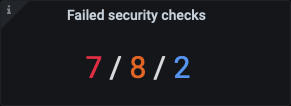
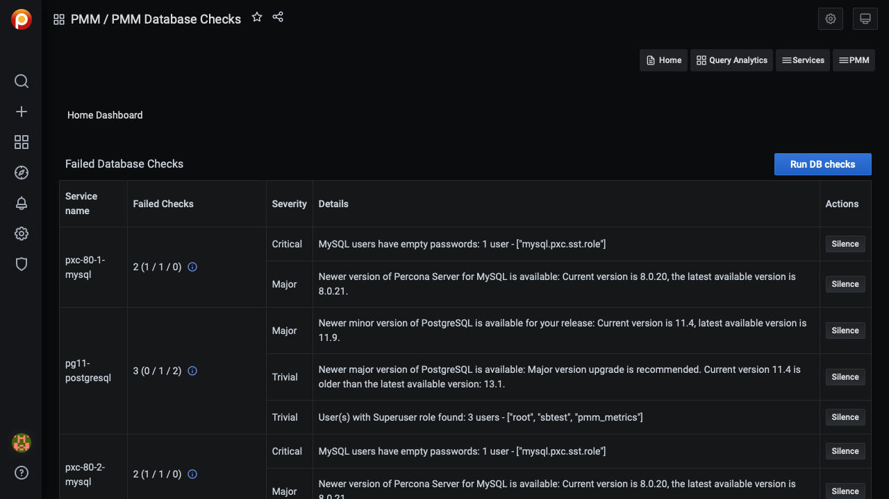

# Security Threat Tool

---

[TOC]

---

The Security Threat Tool runs regular checks against connected databases, alerting you if any servers pose a potential security threat.

The checks are automatically downloaded from Percona Enterprise Platform and run every 24 hours. (This period is not configurable.)

They run on the PMM Client side with the results passed to PMM Server for display in the *Failed security checks* summary dashboard and the *PMM Database Checks* details dashboard.

**Check results data *always* remains on the PMM Server, and is not to be confused with anonymous data sent for Telemetry purposes.**

## How to enable

The Security Threat Tool is disabled by default. Enable it in [*PMM Settings-->Advanced Settings*](../../how-to/configure.md#advanced-settings).

**After activating the Security Threat Tool, you must wait 24 hours for data to appear in the dashboard.**

## Where to see the results

On the PMM home page, the *Failed security checks* panel shows the number of failed checks classed as critical (red), major (amber), and trivial (blue).

  

    <h3 class="panel-title">Key</h3>
  

  

    <b style="color:#e02f44;">Critical</b> &sol; <b style="color:#e36526;">Major</b> &sol; <b style="color:#5794f2;">Trivial</b>
  

You can see more details by opening the *PMM Database Checks* dashboard (select *PMM-->PMM Database Checks*).

## List of checks made

| Check ID                | Description
| ----------------------- | ----------------------------------------------------------------
| `mongodb_auth`          | MongoDB authentication is disabled
| `mongodb_version`       | MongoDB/PSMDB version is not the latest
| `mysql_anonymous_users` | There are accounts with no username
| `mysql_empty_password`  | There are users without passwords
| `mysql_version`         | MySQL/PS/MariaDB version is not the latest
| `postgresql_super_role` | PostgreSQL has users (besides `postgres`, `rdsadmin`, and `pmm_user`) with the role 'SUPER'
| `postgresql_version`    | PostgreSQL version is not the latest
