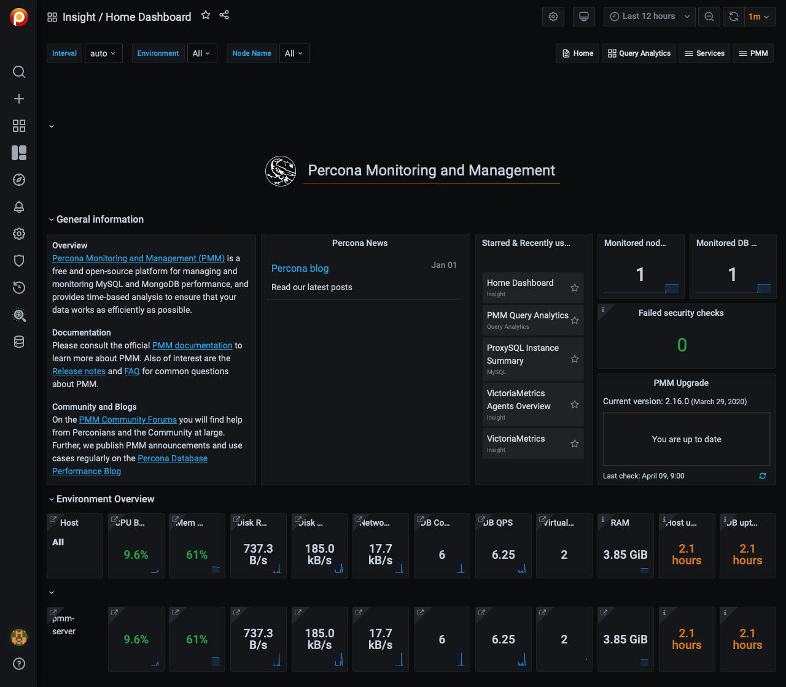

# Welcome

Percona Monitoring and Management (PMM) is a free, open-source database and system monitoring tool for MySQL, PostgreSQL, MongoDB, ProxySQL, and the servers they run on.

!!! alert alert-success "This is the technical documentation for the latest release: [PMM {{release}}](release-notes/{{release}}.md)"

---

[TOC]

---

## What is *Percona Monitoring and Management*?

PMM is software that helps you improve the performance of database instances, simplify their management, and strengthen their security. With it, you can:

- Visualize a wide range of out-of-the-box system performance details
- Collect and analyze data across complex multi-vendor system topologies
- Drill-down and discover the cause of inefficiencies
- Anticipate performance issues, troubleshoot existing ones
- Watch for potential security issues and remedy them

PMM is efficient, quick to set up and easy to use. It runs in cloud, on-prem, or across hybrid platforms. It is supported by [Percona's legendary expertise](https://www.percona.com/services) in open source databases, and by a [vibrant developer and user community](https://www.percona.com/forums/questions-discussions/percona-monitoring-and-management).

!!! alert alert-info "Try the online demo at <https://pmmdemo.percona.com/>"

## How it works

PMM is a client/server application built by Percona with their own and third-party open-source tools.

To set it up, you must:

- install and configure a PMM Client on each host to be monitored. The PMM Client package provides exporters for different database and system types, and administration tools and agents.
- install and run a PMM Server that communicates with clients, receiving metrics data and presenting it in a web-based user interface.

We provide packages for both PMM Server and PMM Client.

```plantuml source="resources/1_PMM_Context.puml"
```

(See more in [Architecture](details/architecture.md).)

### PMM Server

PMM Server is the heart of PMM. It receives data from clients, collates it and stores it. Metrics are drawn as tables, charts and graphs within [*dashboards*](details/dashboards/), each a part of the web-based [user interface](using/interface.md).



PMM Server can run as:

- [A Docker container](setting-up/server/docker.md);
- An [OVA/OVF virtual appliance](setting-up/server/virtual-appliance.md) running on VirtualBox, VMWare and other hypervisors;
- An [Amazon AWS EC2 instance](setting-up/server/aws.md).

!!! alert alert-info "Quickstart installation <{{ extra.quickstart }}>"

### PMM Client

PMM Client runs on every database host or node you wish to monitor. The client collects server metrics, general system metrics, and query analytics data, and sends it to the server.

You must set up and configure PMM clients for each monitored system type:

- [MySQL](setting-up/client/mysql.md)
- [Percona Server for MySQL](setting-up/client/percona-server.md)
- [MongDB](setting-up/client/mongodb.md)
- [PostgreSQL](setting-up/client/postgresql.md)
- [ProxySQL](setting-up/client/proxysql.md)
- [Amazon RDS](setting-up/client/aws.md)
- [Linux](setting-up/client/linux.md)
- [External services](setting-up/client/external.md)

### Percona Enterprise Platform

[Percona Enterprise Platform](using/platform/) (in development) provides value-added services for PMM.

#### Security Threat Tool

Security Threat Tool checks registered database instances for a range of common security issues. (You must [turn on *Telemetry*](how-to/configure.md#advanced-settings) to use this service.)
