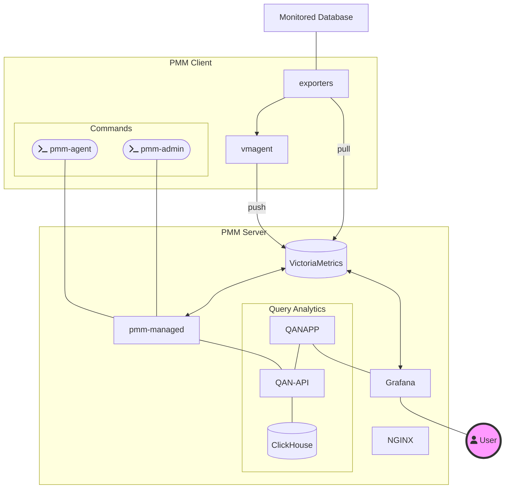

```mermaid
flowchart TB

    VM[("VictoriaMetrics")]
    CL[("ClickHouse")]
        GR["Grafana"]
        MN["Monitored Database"]
    AD(["fa:fa-terminal pmm-admin"])
    AG(["fa:fa-terminal pmm-agent"])
    US(("fa:fa-user User"))
    style US fill:#f9f,stroke:#333,stroke-width:4px

    subgraph "PMM Server"
        subgraph QAN ["Query Analytics"]
            QANAPP---QAN-API
            QAN-API---CL
        end

        NGINX
        pmm-managed
        VM
        GR
    end

    MN---exporters
    subgraph "PMM Client"
        exporters-->vmagent
        subgraph "Commands"
            AD
            AG
        end
    end

    VM<-->pmm-managed---QAN-API
    QANAPP---GR---US
    exporters-->|pull|VM<-->GR
    vmagent-->|push|VM
    AD --- pmm-managed
    AG --- pmm-managed
```
