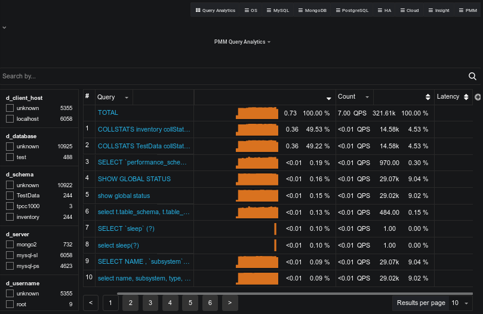

.. _pmm.qan:

.. include:: /.res/qan-redirect.rst  
  
############
Introduction
############ 

The :guilabel:`Query Analytics` (QAN) dashboard shows how queries are executed and where they spend their time.  It helps you analyze database queries over time, optimize database performance, and find and remedy the source of problems.

QAN displays metrics in both visual and numeric form; performance-related characteristics appear as plotted graphics with summaries.

.. note::

   Query Analytics only supports MySQL and MongoDB. The minimum requirements for MySQL are:

   * MySQL 5.1 or later (if using the slow query log)
   * MySQL 5.6.9 or later (if using Performance Schema)

  
  A QAN bar graph that shows a query's total time made up of colored segments, each segment representing the proportion of time spent on one of the follow named activities:

      - ``query_time`` - Elapsed time between receiving a request and the returned result.
      - ``lock_time``
      - ``blk_read_time``
      - ``blk_write_time``
      - ``innodb_io_r_wait``
      - ``innodb_queue_wait``
      - ``innodb_rec_lock_wait``
      - ``other`` - Remaining uncategorized query time.
